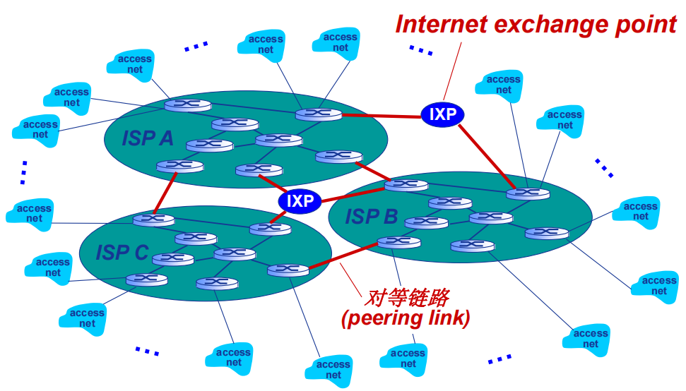
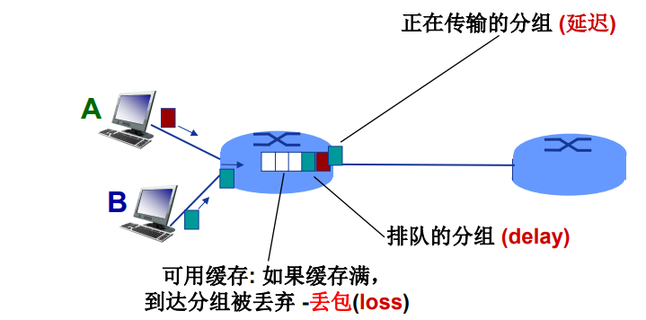

# CH1. Intro to internet

## I.A The Internet: A nuts and bolts (device-view)
----
### Networks

* network = collection of `device`, `routers`, `links`
* managed by organization

----
### Made of connected computing devices

* hosts = end systems

----
### Packet switches
* transmitted data -> packets (chunks of data)
* transmitted by `routers` and `switches`

----
### Communication links

* wire link: fiber, copper
* wireless link: radio, satelite
* transmission rate, bandwidth
----
### Internet
* ISP = Internet Service Provider
* Internet = network of networks = interconnected ISPs
----
### Protocols
* all communication activity in Internet governed by protocols;
* control sending, receiving of messages;
* define the format, order of messages sent and received among network entitles, and actions taken on msg transmission, receipt;
* e.g., HTTP(Web), streaming video, Skype, TCP, IP, WiFi, Ethernet...etc.
----  
### Internet standards
* RFC: Request for Comments;
* IETF: Internet Engineering Task Force, a well known organization that makes standards;
* The IETF publishes RFC for standards building.
* There are other organizations making standards.
----
## I.B The Internet: service-view
----
### Infrastructure that provides services to applications
* e.g., Web, streaming video, multimedia teleconferencing, games, interconnected appliances...;
* provides programming interface to distributed applications;
* `hooks` allowing sending/receiving apps to `connect` to, use Internet transport service;
* provides service options, analogous（模擬） to postal（郵政） service.
----
### A closer look at Internet structure
*Network edge*
* hosts: clients and servers;
* servers often in data centers.

*Access networks physical media*
* wired, wireless communication links.

*Network core*
* interconnected routers;
* network of networks;
* governed by ISPs.
----
### How to connect end systems to edge router?
* residential access nets (home);
* institutional access networks (school, company);
* mobile access networks (WiFi, 4G/5G).
----
### What to look for
* transmission rate (bits per second, bits/s) of access network?
* shared or dedicated（專用） access among users?
----
## II. Access networks
----
### cable-based access

||*cable*||
|:----:|:----:|:----:|
||cable modem||
||\|||
||splitter||
||\|||
||cable headend (CMTS)||
||\|||
||ISP router|| 

* modem = modulation-demodulation device
* CMTS = cable modem termination system
* Cable will not only transmit data, but also video and control signals;
* FDM (frequency division multiplexing):  
different channels transmitted in different frequency bands;
* HFC (hybrid fiber coax):  
asymmetric: up to 40 Mbps ~ 1.2 Gbps downstream, 30 ~ 100 Mbps upstream;
* network of cable, fiber attaches homes to ISP router:  
homes share access network to cable headend.

----
### digital subscriber line (DSL)

|||*DSL*|||
|----:|:----:|:----:|:----:|:----|
|||DSL modem|||
|||\|||
|phone|-|splitter|||
|||\|||voice, data transmitted at different frequencies over `dedicated` line to central office|
|telephone network|-|central office (DSLAM)|||
|||\|||
|||ISP router||

* DSLAM = DSL access multiplexer
* use existing telephone line to central office DSLAM;  
    * data over DSL phone line goes to Internet;
    * voice over DSL phone line goes to telephone network;
* 24 ~ 52 Mbps dedicated downstream transmission rate;
* 3.5 ~ 16 Mbps dedicated upstream transmission rate;
----
### Wireless access networks
* Shared wireless access network connects end system to router;
* Sharing the network via base station a.k.a. `access point`;
* Wireless local area network (`WLAN`):
    * typically within or around building (~ 100 ft);
    * standards: 802.11 b/g/n/ac/ax, made by IEEE 802 LAN/MAN Standards Committee;
    * IEEE = Institute of Electrical and Electronics Engineers;
    * not all the 802.11 standards refer to the transmission rate (speed);
    * t-rate > 1Gbps;
* Wide-area cellular access networks
    * provided by mobile, cellular network operator (~ 10 km);
    * e.g., 4G/5G cellular networks;

----
### Enterprise networks
* companies, universities, etc;
* mix of wired, wireless link technologies, connecting a mix of switches and routers:
    * Ethernet: wired access at 100 Mbps, 1Gbps, 10Gbps...
    * WiFi: see above;

----
## III. Physical media
----
### Host: sends packets of data

* host sending function
    * takes application message;
    * breaks into smaller chunks, known as packets, of length `L` bits (Size);
    * transmits packet into access network at transmission rate `R` (Speed);
        * link transmission rate, a.k.a. link capacity or link bandwidth;
    * packet transmission delay (sec) = ${L (bits) \over R(bits/sec)}$
    * usually length of a packet on Internet will be around 1000 byte ~= 8000 bits
----
### Links: physical media

* bit  
    propagates between transmitter/receiver pairs;
* physical link  
    what lies between transmitter & receiver;
* guided media  
    signals propagate in solid media: copper, fiber, coaxial;
* unguided media  
    signals propagate freely, e.g., radio
* Twisted pair (TP)
    * two insulated copper wires;
    * the most common wires;
    * usually attached with RJ45 plug;
    * Four pair twisted wires in one major wire;
    * Category 5: 100 Mbps, 1Gbps Ethernet;
    * Category 6: 10 Gbps Ethernet;
* Coaxial cable
    * two concentric copper conductors
    * bidirectional
    * broadband
        * multiple frequency channels on cable;
        * 100's Mbps per channel;
* Fiber optic cable
    * glass fiber carrying light pulses;
    * each pulse a bit;
    * high-speed operation
        * high-speed point-to-point transmission (10's - 100's Gbps)
    * low error rate
        * repeaters spaced far apart;
        * immune to electromagnetic noise;
* Wireless radio
    * signal carried in electromagnetic spectrum;
    * no physical wire;
    * broadcast and `half-duplex` (sender to receiver), which means data can be transmitted from both side but not at the same time;
    * propagation environment effects:
        * reflection;
        * obstruction by physical objects;
        * interference
* Radio link types
    * terrestrial（地面） microwave
        * up to 45 Mbps channels
    * Wireless LAN (WiFi)
        * \> 1 Gbps
    * wide-area (e.g., cellular)
        * 4G cellular: ~ 10 Mbps
    * satellite
        * up to 45 Mbps per channel;
        * 270 msec end-den delay;
        * geosynchronous versus low-earth-orbit
* Watch packets (Software): Wireshark
----
## IV. The network core: Forwarding
----
### The net work core

* mesh of interconnected routers;
* packet-switching: hosts break application-layer messages into packets
    * forward packets from one router to the next, across links on path from source to destination;
    * each packet transmitted at full link capacity.
----
### Packet-switching: store-and-forward

* Transmission delay: takes L/R seconds to transmit (push out) L-bit packet into link at R bps;
* Store and forward: entire packet must arrive at router before it can be transmitted on next link;
* End-end delay: 2 * L/R (for example above), assuming zero propagation delay (more on delay shortly);
* One-hop numerical example:
    * L = 10 Kbits
    * R = 100 Mbps
    * one-hop transmission delay = ${(10 * 1e3)\over(100 * 1e6)}$ = 1e-4 = 0.1 $\mu s$
----
### Packet-switching: queueing delay, loss

* Packet queuing and loss: if arrival rate (in bps) to link exceeds transmission rate (bps) of link for a period of time
    * packets will queue, waiting to be transmitted on output link;
    * packets can be dropped (lost) if memory (buffer) in router fills up.
----
### Two key network-core function

* routing algorithm
    * global action (taken by global routers): determine paths/link to destination of packets;
    * writes forwarding table;
* forwarding table
    * local action (taken by local router): move arriving packets from router's input link to appropriate router output link;
    * dictionary of header values to output links;
----
## V.A Packet switching versus circuit switching
----
### Alternative to packet switching: circuit switching
`end-end resources allocated to, reserved for "call" between source and destination`
* in diagram, each link has four circuits
    * call gets 2nd circuit in top link and 1st circuit in right link;
* dedicated resources: no sharing
    * circuit-like (guaranteed) performance;
* circuit segment idle if not used by call (no sharing);
* commonly used in traditional telephone network.
----
### Circuit switching: FDM and TDM
* Frequency Division Multiplexing (FDM)
    * optional, electromagnetic frequencies divided into (narrow) frequency bands;
    * each call allocated its own band, can transmit at max rate of that narrow band.  
    
* Time Division Multiplexing (TDM)
    * time divided into slots
    * each call allocated periodic slot(s), can transmit at maximum rate of (wider) frequency band, but only during its time slot(s)
    
----
### Is packet switching a "slam dunk winner"?
* great for "bursty" data - sometimes has data to send, but at other times not
    * resource sharing;
    * simpler, no call setup;
* excessive congestion possible - packet delay and loss due to buffer overflow
    * protocols needed for reliable data transfer, congestion control;
* How to provide circuit-like behavior?
    * bandwidth guarantees traditionally used for audio/video applications.
----
## V.B Internet Structure
----
### Internet structure: a "network of networks"
* Hosts connect to Internet via access ISPs
    * residential, enterprise (company, university, commercial) ISPs
* Access ISPs in turn must be interconnected
    * so that any two hosts can send packets to each other
* Resulting network of networks is very complex
    * evolution was driven by economics and national policies

* At "center": small number of well-connected large networks
    * `"tier-1" commercial ISPs` (e.g., Level 3, Sprint, AT&T, NTT)  
    national & international coverage
    * `content provider networks` (e.g., Google, Facebook)  
        private network that connects its data centers to Internet, often bypassing tier-1, regional ISPs.
----
## VI. Packet delay
----
### How do packet loss and delay occur?
* Packets queue in router buffers
    * packets queue, wait for turn;
    * arrival rate to link (temporarily) exceeds output link capacity -> packet loss
----
### Packets delay: four sources

* nodal = node  
* dproc - nodal processing:
    * check bit errors
    * determine output link
    * typically time cost < ms
* dqueue - queueing delay:
    * time waiting at output link for transmission
    * depends on congestion level of router
* dtrans - transmission delay:
    * L: packet length (bits)
    * R: link transmission rate (bps)
    * dtrans = ${L \over R}$
* dprop - propagation delay:
    * d: length of physical link (m)
    * s: propagation speed (by copper ~ 2 x 108 m/sec)
    * dprop = ${d \over s}$
* most time consumption came from queue delay
---
### Packet queueing delay (revisited)

* L: packet length (bits)
* R: link bandwidth (bps)
* a: average packet arrival rate
* traffic intensity (Itraffic) = $aL  \over R$
---
* Itraffic ~ 0: avg. queueing delay small
* Itraffic -> 1: avg. queueing delay large
* Itraffic > 1: arriving "work" exceed service limit -> infinite average delay!
---
### "Real" Internet delays and routes
`what do real internet delay & loss look like?`
* hosts are connected via numerous routers
* traceroute program: provides delay measurement from source to router along end-end internet path towards destination. For all i:
* sends three packets that will reach router i on path towards destination (with time-to-live field value of i)
* router i will return packets to sender
* sender measures time interval between transmission and reply

---
### Packet loss
* queue (aka buffer) preceding link in buffer has finite capacity
* packet arriving to full queue dropped (aka lost)
* lost packet may be retransmitted by previous node, by source end system, or not at all

---
### Throughput（吞吐量）
* throughput: rate (bits/time unit) at which bits are being sent from sender to receiver
    * instantaneous(瞬時): rate at given point in time
    * average: rate over longer period of time
    * Rc: throughput of client;
    * Rs: throughput of server;
    * R: throughput of middle links;

* bottleneck link: link on end-end path that constrains end-end throughput;
* per-connection end-end throughput = min(Rc,Rs, R/10);
* in practice: Rc or Rs often is the bottleneck.
---
## VII. Network security
* field of network security:
    * how hacker can attack computer networks;
    * how we can defend networks against attacks;
    * how to design architectures that are immune to attacks;
* Internet not originally designed with (much) security in mind
    * original vision:
        "a group of mutually trusting users attached to a transparent network";
    * Internet protocol designers playing "catch up";
    * security considerations in all layers!
---
### Bad guys: malware
* malware can get in host from:
    * virus: self-replicating infection by receiving/executing object (e.g., e-mail attachment);
    * worm: self-replicating infection by passively receiving object that gets itself executed;
* spyware malware can record keystrokes, web sites visited, upload info to collect site;
* infected host can be enrolled in `botnet(殭屍網路)`, used for spam(垃圾信件) or distributed denial of service (DDoS分散式服務阻斷) attacks.
---
### Bad guys: denial of service
`Denial of Service (DoS)`
attackers make resources (server, bandwidth) unavailable to legitimate(合法) traffic by overwhelming resource with bogus(虛假) traffic.
1. Select target;
2. break into host around the network (see botnet);
3. send packets to target from compromised hosts

* infected host can be enrolled in botnet, used for spam or distributed denial of service (`DDOS`) attacks.
---
### Bad guys: packet interception
`packet "sniffing"`
* broadcast media (shared Ethernet, wireless);
* promiscuous network interface reads/records all packets (e.g., including passwords!) passing by.
---
### Bad guys: fake identity
`IP spoofing`: attacker send packet with false source address.

---
## VIII. Protocol Stack
Networks are complex, with many elements:
* hosts
* routers
* links of various media
* applications
* protocols
* hardware, software

Is there any hope of organizing structure of network? ...or at least our discussion of networks? -> Layer

---
### Why layering?

`Dealing with complex systems:`
* explicit structure allow identification, relationship of complex system's pieces
    * layered reference model for discussion
* modularization eases maintenance, updating of system
    * change in layer's service implementation:  
        transparent to rest of system
    * e.g., change in gate procedure doesn't affect rest of system.

---
### Internet `protocol` stack
From high layer to low layer  
* Layer7-`application`: supporting network applications  
    * IMAP, SMTP, HTTP  
* Layer4-`transport`: process-process data transfer
    * TCP, UDP
* Layer3-`network`: routing of datagram from source to destination
    * IP protocols, routing protocols
* Layer2-`link`: data transfer between neighboring network elements
    * Ethernet(802.3), WiFi(802.11), PPP
* Layer1-`physical`: bits "on the wire"

Usually when we talk about protocol stack, we are referring to:  

However, officially, there should be two more layers of the stack:  

### Encapsulation

* Encapsulation: Process of adding header

message -> add header of transport layer -> segment

segment -> add header of network layer -> datagram

datagram -> add header of link layer -> frame

