# CH2. Level7: Application Layer

## I.Overview
----
### Content

* conceptual and implementation aspects of application-layer protocols
    * client-server paradigm
    * peer-to-peer paradigm (P2P)

* learn about protocols from popular application-layer protocols
    * HTTP
    * SMTP, IMAP
    * DNS

* programming network applications
    * socket API

---
### Creating a network app

* write programs that:
    * run on (different) end systems
    * communicate over network
    * e.g., web server software communicated with browser software

* no need to write software for network-core devices
    * network-core devices do not run user applications
    * applications on end systems allows for rapid app development, propagation

---
### Client-server paradigm

* Server
    * always-on host
    * permanent IP address
    * often in data centers, for scaling

* Client
    * contact, communicate with server
    * may be intermittently (間接的) connected
    * may be dynamic IP addresses
    * do not communicate directly with each other
    * e.g., HTTP, IMAP, FTP
---
### Peer-peer architecture

* no always-on server
* arbitrary end systems directly communicate
* peers request service from other peers, provide service in return to other peers;
* `self scalability`: new peers bring new service capacity, as well as new service demands.
* peers are intermittently connected and change IP addresses frequently
    * complex management

---
### Processes communicating
* process: program running within a host
    * within same host, two processes communicate using inter-process communication (defined by OS)
    * processes in different hosts communicate by exchanging messages

* clients, servers
    * client process: process that initiates communication
    * server process: process that waits to be contacted

---
### Socket

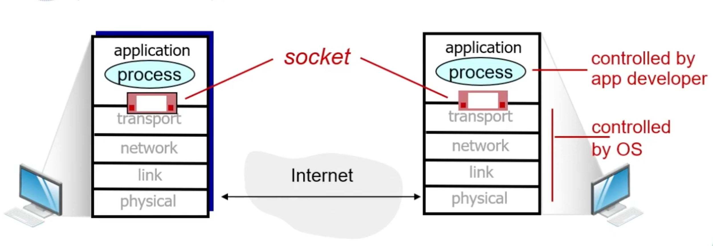

* process sends/receive messages to/from its socket
* socket analogous to door
    * sending process shoves message out door
    * sending process relies on transport infrastructure//基礎架構 on other side of door to deliver message to socket at receiving process
    * two sockets involved: one on each side

* to receive messages, process must have identifier
* host device has unique 32-bit IP address  
* `Does IP address of host on which process runs suffice for identifying the process?` No, many processes can be running on same host -> using port

---

### Addressing process

* Identifier includes `IP address` and `port numbers` associated with process on host. IP address for device, port for process.
* port numbers example
    * HTTP server: 80
    * mail server: 25
* to send HTTP message to gaia.cs.umass.edu web server:
    * IP address: 128.119.254.12
    * port number: 80
---

### An application-layer protocol defines

* types of message exchange
    * request, response
* message syntax//句法
    * what fields in messages & how fields are delineated//劃定
* message semantics//語義
    * meaning of information in fields
* rules for when and how process send & respond to messages

* open protocols
    * defined in (IETF) RFCs, everyone has access to protocol definition
    * allows for interoperability
    * e.g., HTTP, SMTP

* proprietary protocols
    * e.g., Skype, Line, Online game
    * provides high security for data transmit

* `What transport service does an app need?`  
    Should consider with
    * data integrity
        * Some apps (e.g., file transfer, web transactions) require 100% reliable data transfer
        * other apps (e.g., audio/video) can tolerate some loss
    * throughput
        * some apps (e.g., multimedia) require minimum amount of throughput to be 'effective'
        * other apps ('elastic apps') make use of whatever throughput they get (e.g., email)
    * timing
        * some apps (e.g., Internet telephony, interactive games) require low delay to be "effective"
    * security
        * encryption, data integrity,...

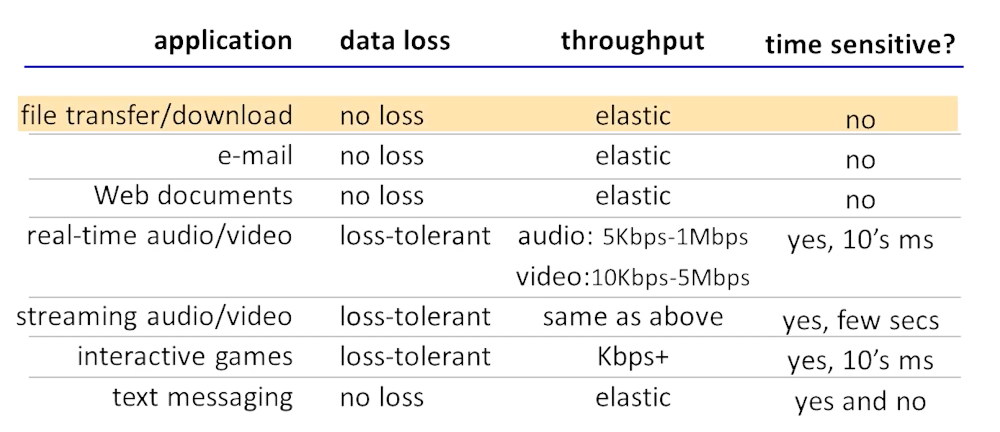

---
### Securing TCP

* Vanilla TCP & UDP sockets
    * no encryption
    * clear text passwords sent into socket traverse Internet in clear text (!)

* Transport Layer Security (TLS) 
    * provides encrypted TCP connections
    * data integrity
    * end-point authentication

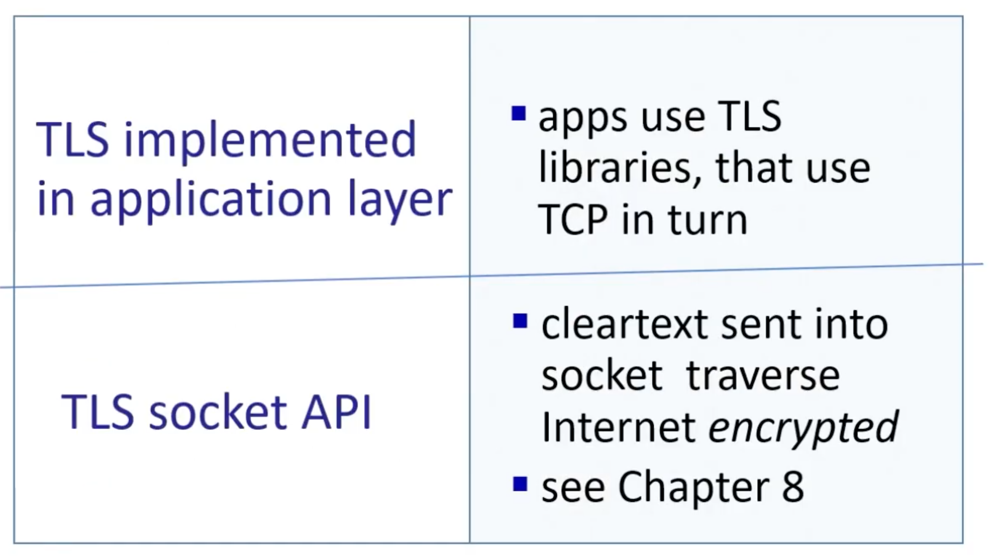

---
### Web and HTTP
First, a quick review
* web page consists of `objects`, each of which can be on different Web servers
* object can be HTML file, JPEG image, Java applet, audio file,...
* web page consists of base `HTML-file` which includes several referenced objects, each addressable by a `URL`, e.g.,

---
### HTTP overview

* `HTTP: Hypertext transport protocol`
    * Web's application layer protocol
    * client/server model:
        * client: browser does: 
            * requests, receives via HTTP protocol;
            * displays Web objects.
        * server: Web server sends objects in response to requests

* `HTTP uses TCP` 

    Step-by-Step
    1. Client initiates TCP connection (creates socket) to server, port 80
    2. server accepts TCP connection from client
    3. HTTP messages (application-layer protocol messages) exchanged between browser (HTTP client) and Web server (HTTP server)
    4. TCP connection closed

* `HTTPs = HTTP over TLS`
    * port 443

* `HTTP is "stateless"`
    * server maintains no information about past client requests
    ---
    ### aside  
    protocol that maintain "state" are complex!
    * past history (state) must be maintained;
    * if server/client crashes, their views of "state" may be inconsistent, must be reconciled
    ---
---
### HTTP connections: two types
* `Non-persistent HTTP`
    * pipelines
        1. TCP connection opened
        2. at most one object sent over TCP connection
        3. TCP connection closed

    * issues
        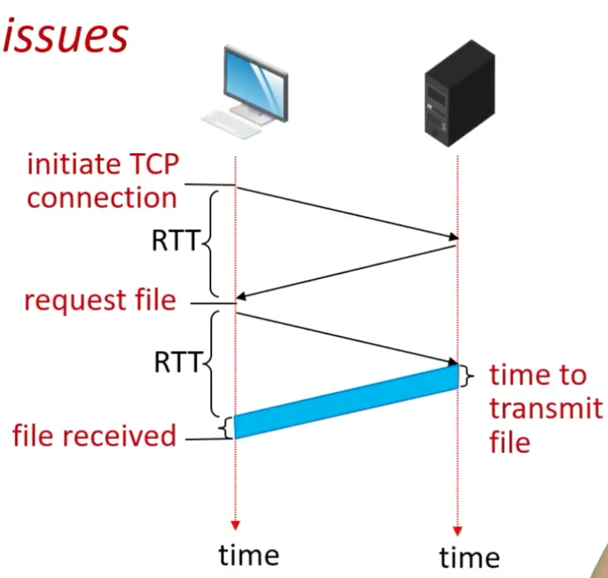  
        * RTT = Round Trip Time
        * requires 2 RTTs per object (one for building connection, one for object transport)
        * OS overhead for each TCP connection
        * browsers often open multiple parallel TCP connections to fetch referenced objects in parallel

    downloading multiple objects required multiple connections
* `Persistent HTTP` (Supported after HTTP 1.1)
    * pipelines
        1. TCP connection opened to a server
        2. multiple objects can be sent over single TCP connection between client, and that server
        3. TCP connection closed
    * issues
        * server leaves connection opened after sending response
        * subsequent HTTP messages between same client/server sent over connection
        * client sends requests as soon as it encounters a referenced object
        * as little as one RTT for all the referenced objects (cutting response time in half)
---
### HTTP request message
* two types of HTTP messages: `request`,`response`
* `HTTP request message`:
    * ASCII (human-readable format)

    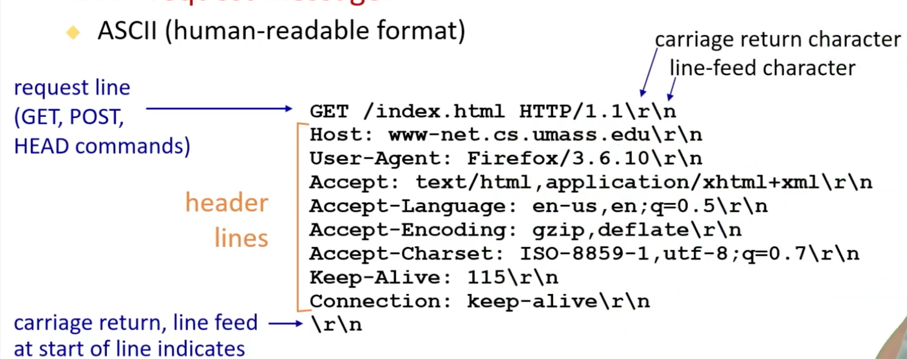

    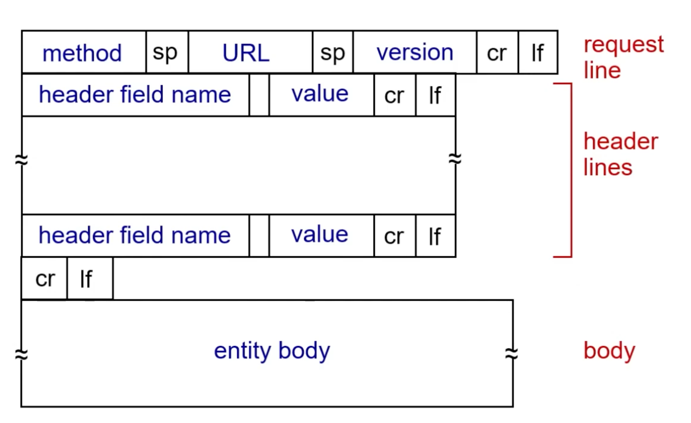

    * methods
        * POST
            * web page often includes form input
            * user input sent from client to server in entity body of HTTP POST request message
        * GET
            * include user data in URL field of HTTP GET request message (following a '?')
            * e.g., www.somesite.com/animalsearch`?monkeys&banana`
        * HEAD
            * requests header (only) that would be returned if specified URL were requested with an HTTP GET method
            * usually would be utilized to check whether the content/object existing on the server
        * PUT
            * upload new file (object) to server
            * completely replaces file that exists at specified URL with content in entity body of POST HTTP request message
    
* `HTTP response message`:

    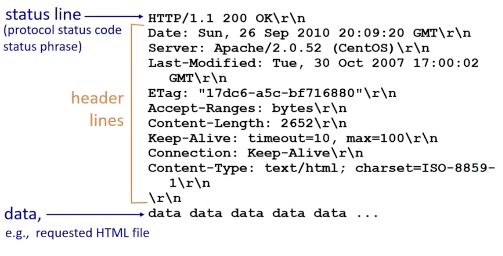

    * HTTP response status codes
        * status code appears in 1st line in server-to-client response message.
        * 200 OK
            * request succeeded, requested object later in this message
        * 301 Moved permanently
            * requested object moved, new location specified later in this message (in Location:field)
        * 304 Not Modified
            * requested object hasn't been modified since specified time. Usually seen on proxy server case.
        * 400 Bad Request
            * request msg not understood by server
        * 404 Not Found
            * requested document not fount on this server
        * 505 HTTP Version Not Supported
---
## III. HTTP cookies

* Recall: HTTP GET/response interaction is stateless
    * no notion of multi-step exchanges of HTTP messages to complete a Web "transaction"
        * no need for client/server to track "state" of multi-step exchange
        * all HTTP requests are independent of each other
        * no need for client/server to "recover" from a partially-completed-but-never-completely-completed transaction.
    * a stateful protocol: client makes two changes to X, or none at all

        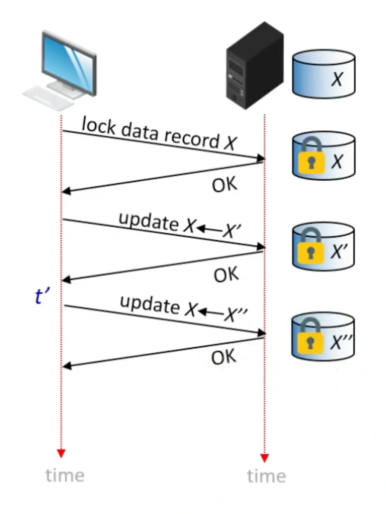
* Maintaining user/server state: cookies
    * Web sites and client browser use `cookies` to maintain some state between transactions
    * four components
        1. cookie header line of HTTP response message
        2. cookie header line in next HTTP request message
        3. cookie file kept on user's host, managed by user's browser
        4. back-end database at Web site

        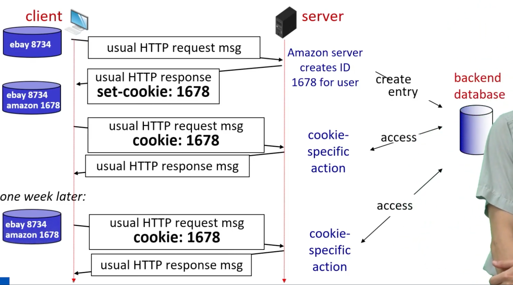

* What cookies can be used for:
    * authorization
    * shopping carts
    * recommendations
    * user session state (Web e-mail)
    ---
    * Challenge: How to keep state:
        * protocol endpoints: maintain state at sender/receiver over multiple transactions
        * cookies: HTTP messages carry state
    ---

* Cookies are powerful, but also need to be careful with to prevent attacks from hackers

---
cookies and privacy:
* cookies permit sites to learn a lot about you on their site.
* third party persistent cookies (tracking cookies) allow common identity (cookie value) to be tracked across multiple web sites
---

## IV. Web caches

### Web caches (proxy server)

`Goal`:  
    satisfy client request without involving origin server

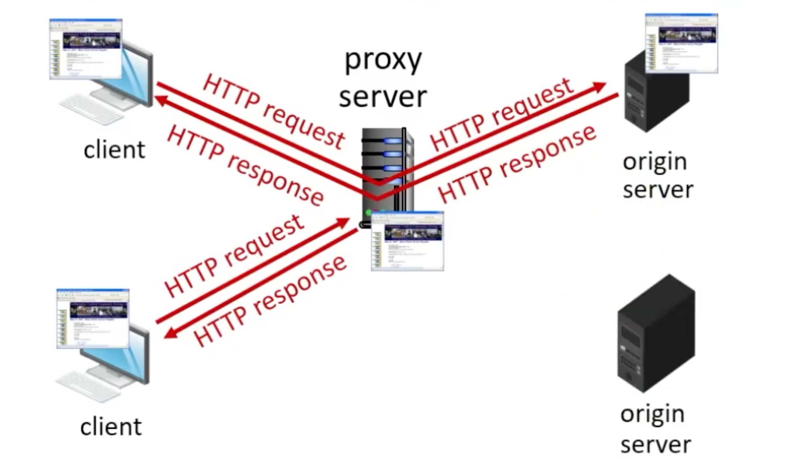

* user configures browser to point to a `Web cache`
* browser sends all HTTP requests to cache
    * if object in cache: cache returns object to client
    * else cache requests object from origin server, caches received object then returns object to client
* Web cache acts as both client and server
    * server for original requesting client
    * client to origin server
* typically cache is installed by ISP

* Benefits
    * reduce response time for client request
        * cache is closer to client
    * reduce traffic on an institution's access link
    * Internet is dense with caches
        * enables "poor" content providers to more effectively deliver content

`What if contents need to be updated frequently?`

`Goal:` don't send object if cache has up-to-date cached version
* no object transmission delay
* lower link utilization
* cache: specify date of cached copy in HTTP request:
    * `If-modified-since:<date>`
* server: response contains no object if cached copy is up-to-date:
    * HTTP/1.0 304 Not Modified

    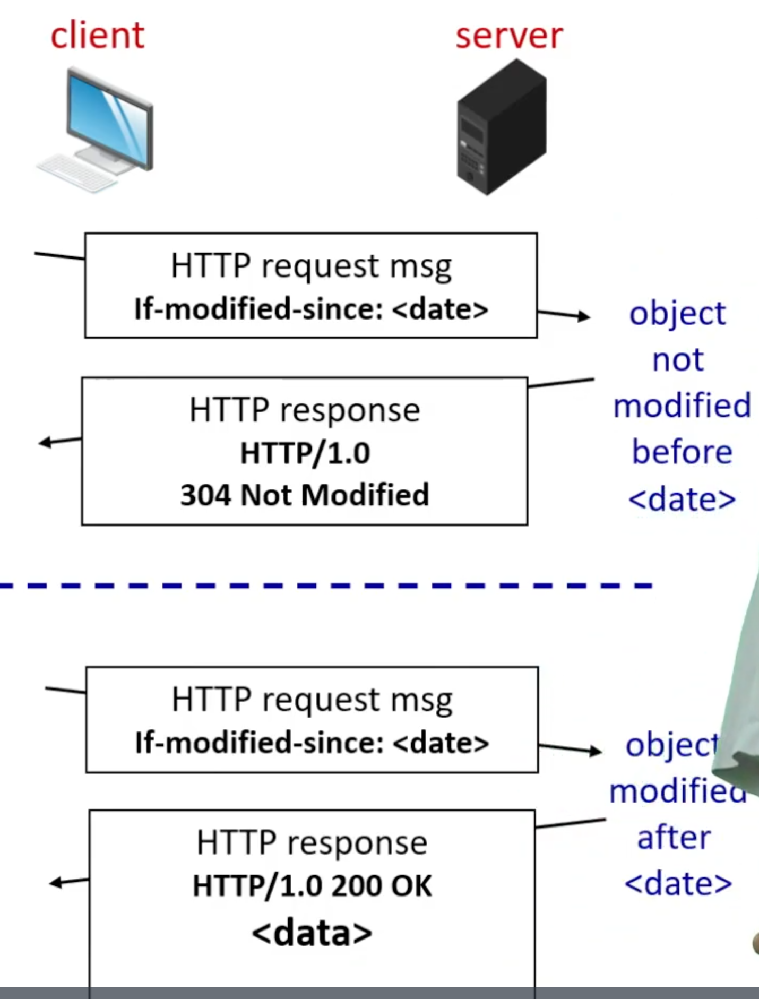

* However, proxy server isn't common used due to:
    * there were more and more web/app provides customized/dynamic contents to clients;
    * the client uses encrypted link which is not allowed to be parsed by proxy server.

---

## V. HTTP2 and HTTP3
---
### HTTP/2

`Key goal`:
    decreased delay in multi-object HTTP requests

* HTTP1.1: introduced multiple, pipelined GETs over single TCP connection
    * server responds in-order (FCFS: first-come-first-served scheduling) to GET requests
    * with FCFS, small object may have to wait for transmission (head-of-line (HOL) blocking) behind large object(s)
    * loss recovery (retransmitting losd TCP segments) stalls object transmission

    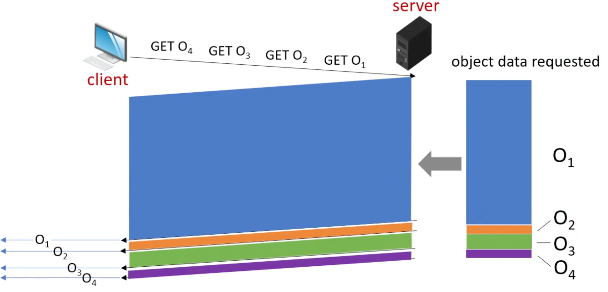

* HTTP/2: [RFC 7540, 2015] increased flexibility at server in sending objects to client
    * methods, status codes, most header fields unchanged from HTTP 1.1
    * transmission order of requested objects based on client-specified object priority (not necessarily FCFS)
    * push un-requested objects to client
    * `divide objects into frames`, schedule frames to mitigate HOL blocking

    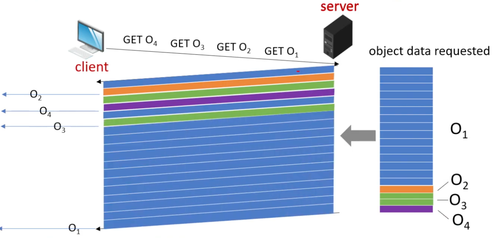

### HTTP/2 to HTTP/3

`Key goal`:
    decreased delay in multi-object HTTP requests

* HTTP/2 over single TCP connection means:
    * recovery from packet loss still stalls all object transmissions
        * as in HTTP 1.1, browsers have incentive to open multiple parallel TCP connections to reduce stalling, increase overall throughput
    * no security over vanilla TCP connection
* HTTP/3: add security, per object error- and congestion-control (more pipelining) over `UDP`
    * more on HTTP/3 in transport layer
    * Google has provide a HTTP/3 liked protocol named `quic`

## VI. SMTP interaction

### E-mail

* Three major components
    * User agents
    * Mail servers
    * simple mail transfer protocol: SMTP

* User Agent
    * a.k.a. "mail reader"
    * composing, editing, reading mail messages
    * e.g., Outlook, Gmail
    * outgoing, incoming messages stored on server

* Mail servers
    * `mailbox` contains incoming messages for user
    * `message queue` of outgoing (to be sent) mail messages
    * `SMTP` protocol between mail servers to send email messages
        * client: sending mail server
        * server: receiving mail server
---
### E-mail: the RFC (5321)
* uses TCP to reliably transfer email message from client (mail server initiating connection) to server, port 25
* direct transfer: sending server (acting like client) to receiving server
* `Three phases of transfer`
    1. handshaking (greeting)
    2. transfer of messages
    3. closure
* command/response interaction (like HTTP)
    * commands: ASCII text
    * response: status code and phrase
* messages (header & body) must be in 7-bit ASCII
---
### Scenario
First, Alice compose a email message 
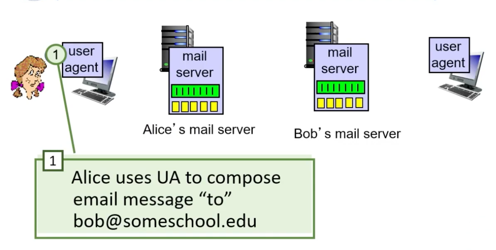
Second, send message to her email server. (Usually might be encrypted and using port:465 or 587)
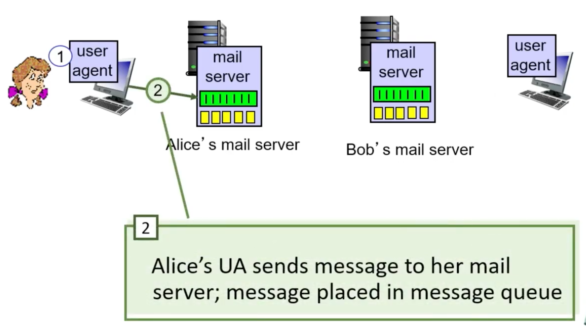
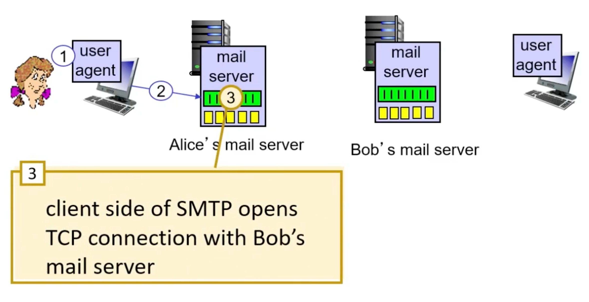
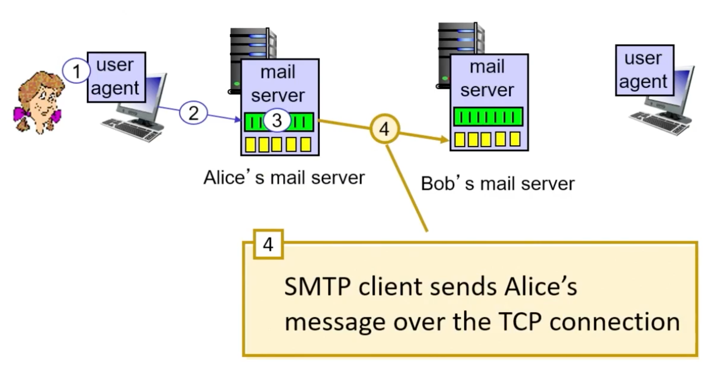
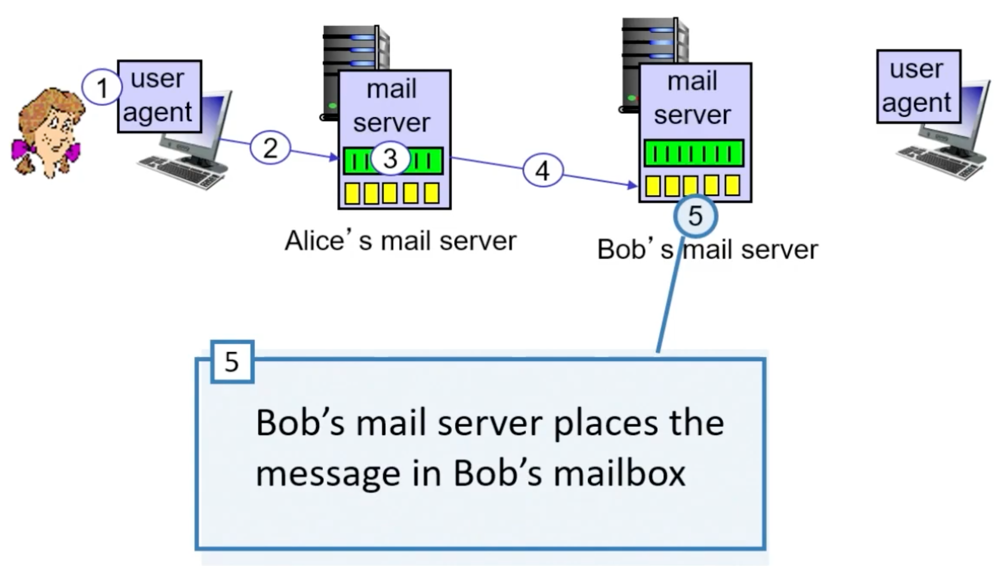
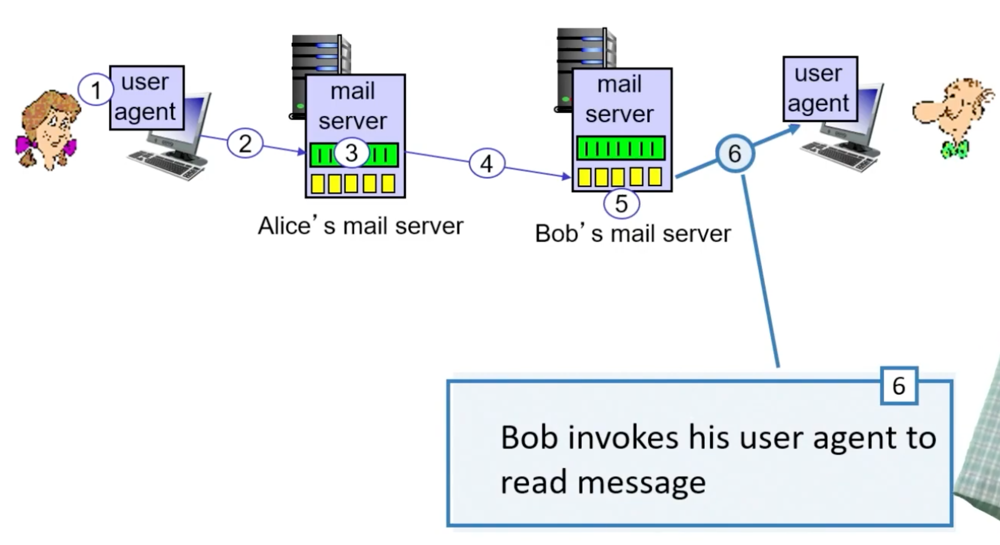

---

### Sample SMTP interaction
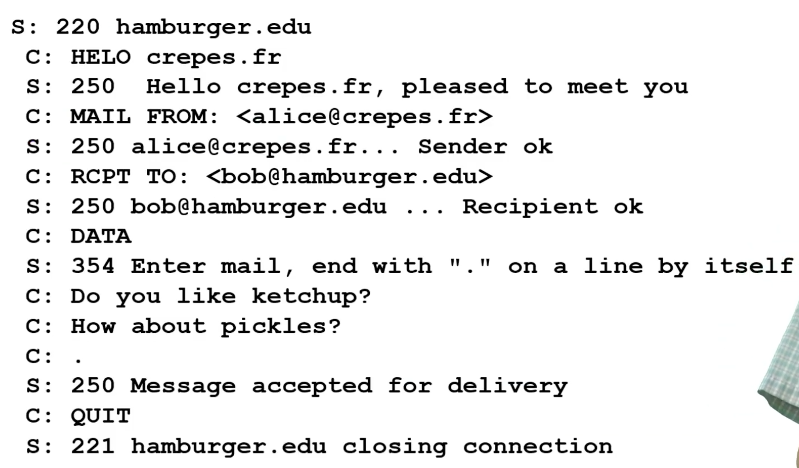

---

### SMTP: closing observations
* Comparison with HTTP
    * HTTP: pull
    * SMTP: push
    `both have ASCII command/response interaction, status codes`
* HTTP: each object encapsulated in its own response message
* SMTP: multiple objects sent in multipart messages
    * SMTP uses persistent connections
    * SMTP server uses CRLF.CRLF to determine end of message

---
### Mail message format

* SMTP: protocol for exchanging e-mail messages, defined in RFC 531 (like HTTP)
* RFC 822 defines syntax for e-mail message itself (like HTML)
    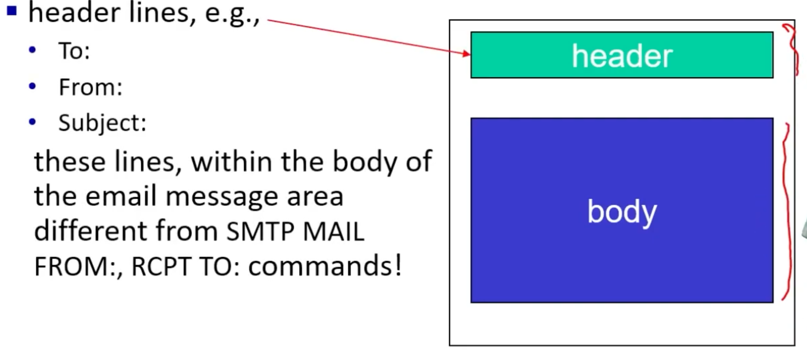
    * Be aware that this is format for mail message, not for SMTP.
---
### Mail access protocols
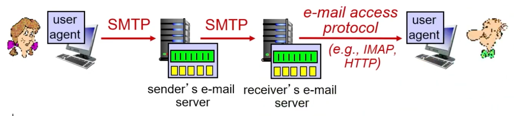

* mail access protocol: retrieval from server
    * IMAP: Internet Mail Access Protocol [RFC 3501]:
        * messages stored on server
        * IMAP provides retrieval, deletion, folders of stored messages on server.
    * HTTP: gmail, Hotmail,...,etc. provide web-mail based interface on top of SMTP, IMAP(or POP3) to retrieve e-mail messages.
---

## VII. Domain Name System

* people: many identifiers:
    * SNN, name, passport #
* Internet hosts, routers:
    * IP address (32 bit) - used for addressing datagrams
    * "name", e.g.,, cs.umass.edu - used by human
---
### Domain Name System (DNS):
* `distributed database` implemented in hierarchy of many name servers
* `application-layer protocol`: hosts, name servers communicate to `resolve` (address/name translation)
    * `resolve`: covert name into IP address
    * note: core internet function, implemented as application-layer protocol
    * complexity at network's "edge"
---
### DNS: services, structure

`Domain Name System (DNS) services`
* hostname to IP address translation
* host aliasing(別名)
    * canonical（主要）, alias（別名） name
* mail server aliasing
* load distribution
    * replicated Web servers: many IP addresses correspond to one name

---
### Why not centralize DNS?
* single point of failure
* traffic volume
* distant centralized database
* maintenance

-> Doesn't scale  
* Comcast DNS servers alone: 600B DNS queries per day

---
### DNS: a distributed, hierarchical database
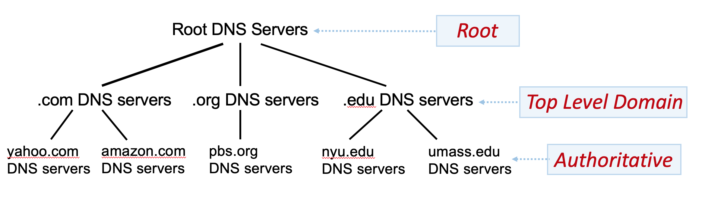

* Root Name Servers: Group of servers governing DNS
* Top Level Domain (TLD): Distributed addresses according to final extension of the addresses, e.g., .com/.org/.edu  
common extension:
    * com: common enterprise used
    * org: non-profit organization
    * edu: educational organization
* Example - client ask IP address of www.amazon.com:
    1. client queries root server to find .com DNS server
    2. client queries .com DNS server to get amazon.com DNS server
    3. client queries amazon.com DNS server to get IP address for www.amazon.com
---
### Root Name Servers

* official, contact-of-last-resort by name servers that can not resolve name
* `incredibly` important Internet function
    * Internet couldn't function without it!
    * DNSSEC - provides security (authentication and message integrity)
    * ICANN (Internet Corporation for Assigned Names and Numbers) manages root DNS domain

    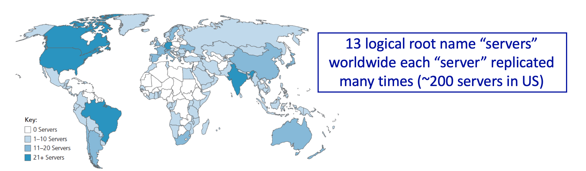
---
### Top Level Domain (TLD) servers

* responsible for .com, .org, .net, .edu, .aero, .jobs, .museums, and all top-level country domains, e.g., .cn, .uk, .fr, .ca, .jp, ...etc
* Network Solutions: authoritative registry for .com, .net TLD
* Educause: .edu TLD
* `Authoritative DNS servers`
    * organization's own DNS server(s), providing authoritative hostname to IP mappings for organization's named hosts
    * can be maintained by organization or service provider
* `Local DNS name servers`
    * does not strictly belong to hierarchy
    * each ISP (residential ISP, company, university) has one
    * also called "default name server"
    * it's common to use local DNS name server first to lower query cost
    * when host makes DNS query, query is sent to its local DNS server
        * has local cache of recent name-to-address translation pairs (but may be out of date)
        * acts as proxy, forwards query into hierarchy
---
### Iterated query

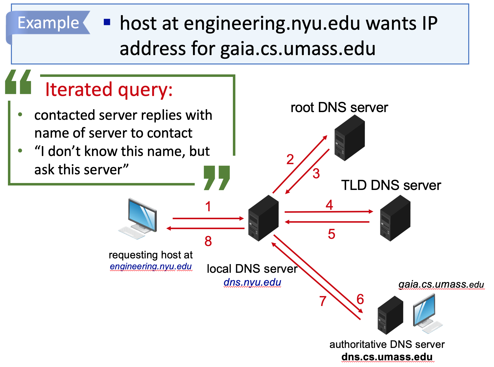

---
### Recursive query

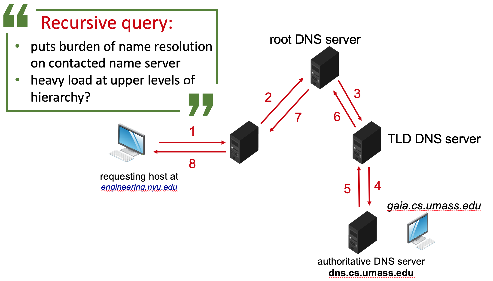

* Generally, recursive query won't be implemented on root DNS server due to heavy work for upper level server. It's just like asking company boss to consult with your apartment manager for you.
---
### Caching, Updating DNS Records

* Once (any) name server learns mapping, it caches mapping
    * cache entries timeout (disappear) after time to life (TTL)
    * TLD servers typically cached in local name servers (thus root name servers not often visited)
* cached entries may be `out-of-date`
    * if name host changes IP address, may not be known Internet-wide until all TTLs expire!
    * "one day" might be a good choice for TTL setting.

* update/notify mechanisms proposed IETF standard (RFC 2136)
---
### DNS distributed database storing resource records (`RR`)

* RR format: (name, value, type, ttl)
    * ttl: unit = second

`type = A`
* name is hostname
* value is IP address

`type = CNAME`
* name is alias name for some "canonical" name
* e.g., www.ibm.com is really servereast.backup2.ibm.com
* Value is canonical name

`type = NS`
* name is domain (e.g., foo.com)
* value is hostname of authoritative name server for this domain

`type = MX`
* value is name of mail server associated with name
---
### DNS protocol messages

* DNS `query` and `reply` messages, both have same `format`

    

* message header:
    * identification: 16 bit # for query, reply to query uses same #
    * flags:
        * query or reply
        * recursion desired
        * recursion available
        * reply is authoritative or cached

    

---
### Inserting records into DNS

* Example: new startup "Network Utopia"

* register name networkuptopia.com at DNS registrar (e.g., Network Solutions)
    * provide names, IP addresses of authoritative name server (primary and secondary)
    * registrar inserts NS, A RRs into .com TLS server:
        * (networkutopia.com, dns1.networkutopia.com, NS) // name server record
        * (dns1.networkutopia.com, 212.212.212.1, A)  // A record
* create authoritative server locally with IP address 212.212.212.1
    * type A record for www.networkuptopia.com
    * type MX record for networkutopia.com

---
### DNS security

`DDoS attacks`
* bombard root servers with traffic
    * not successful to date
    * traffic filtering
    * local DNS servers cache IPs of TLD servers, allowing root server bypass
* bombard TLD servers
    * potentially more dangerous

`Redirect attacks`
* man-in-middle
    * intercept DNS queries
* DNS poisoning
    * send bogus relies to DNS server, which caches

`Exploit DNS for DDoS`
* send queries with spoofed source address: target IP
    * e.g., send 1Mb query packet to DNS server with fake IP (target's IP)
    * usually the DNS server will reply with packet larger than query packet (> 1Mb) to target IP.
* requires amplification

`Solution`: DNSSEC [RFC 4033]

---
## VIII. P2P

### File distribution: client-server versus P2P

`How much tim to distribute file from one server to N peers?`

* File distribution time: client-server 
    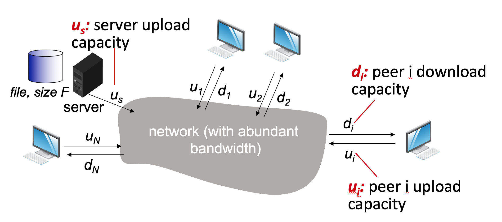

    * peer upload/download capacity is limited resource    
    * `server transmission`: must sequentially send (upload) N files copies:
        * time to send one copy: $F \over u_{s}$
        * time to send N copies: $NF \over u_{s}$
    * `client`: each client must download file copy
        * $d_{min}$ = min client download rate
        * min client download time: $F \over d_{min}$
    * `time to distribute F size file to N peers`:
        * $D_{c-s}$ = max{$NF \over u_{s}$, $F \over d_{min}$}
* File distribution time: P2P
    
    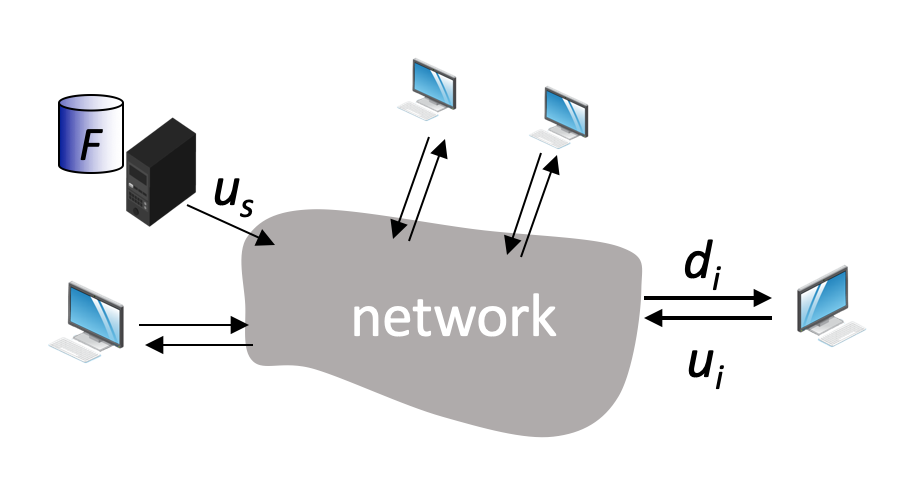

    * `server transmission`: must upload at least one copy
        * time to send one copy: $F \over u_{s}$
    * `client`: each client must download file copy
        * min client download time: $F \over d_{min}$
    * `clients`: as aggregate must download NF bits
        * max upload rate (limiting max download rate) is $u_{s}$ + $\sum u_{i}$

    * `time to distribute F size file to N peers`:
        * $D_{c-s}$ = max{$F \over d_{min}$, $F \over u_{s}$, $NF \over u_{s}+\sum u_{i}$}
* Comparison
    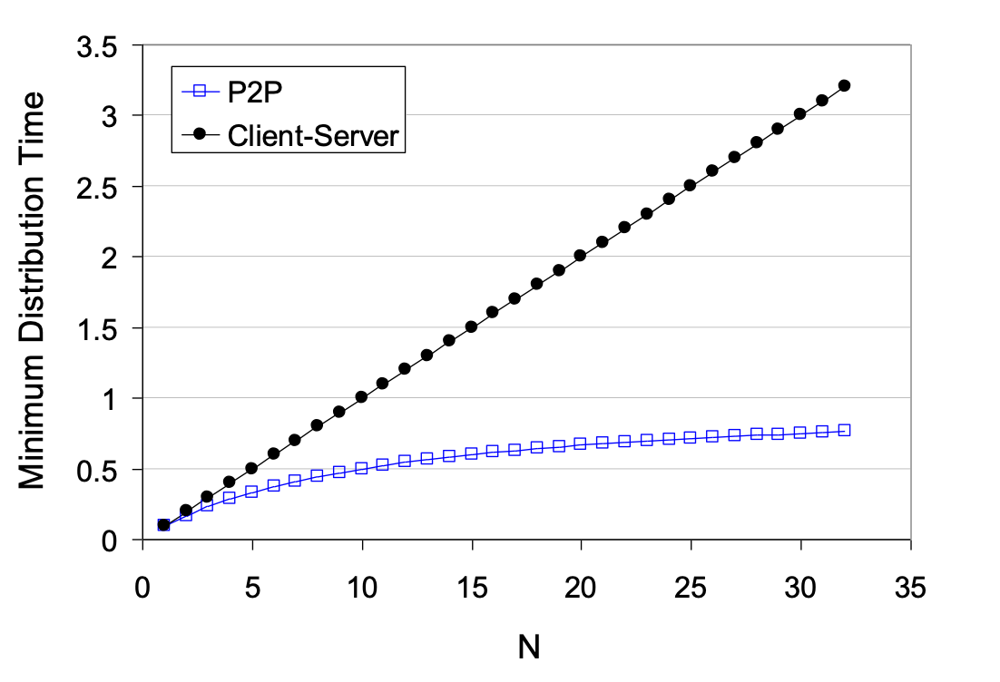

---
### P2P file distribution: BitTorrent
* file divided into 256Kb `chunks`
* peers in torrent send/receive file chunks
* tracker: tracks peers participating in torrent
* torrent: group of peers exchange chunks of a file
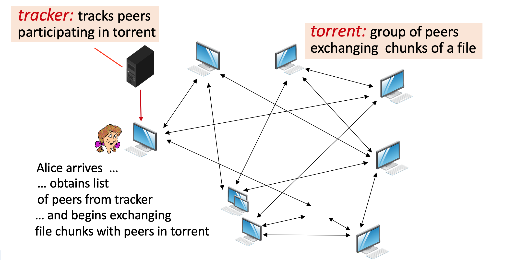

* peer joining torrent:
    * has no chunks at first, but will accumulate them over time from other peers
    * registers with tracker to get list of peers, connects to subset of peers ("neighbors")
* while downloading, peer uploads chunks to other peers
* peer may change peers with whom it exchanges chunk
* `churn`: peers may come and go
* once peer has entire file, it may leave or (altruistically/利他) remain in torrent
---
### BitTorrent: requesting, sending file and chunks

* `Requesting chunks:`
    * at any given time, different peers have different subsets of file chunks
    * periodically, Alice asks each peer for list of chunks that they have
    * Alice requests missing chunks from peers, `rarest first`
* `Sending chunks: tit-for-tat`
    * Alice sends chunks to those four peers currently sending her chunks at highest rate
        * other peers are choked by Alice (would not receive chunks from her)
        * re-evaluate top 4 every 10 secs
    * every 30 secs: randomly select another peer, starts sending chunks
        * "optimistically unchoke" this peer
        * newly chosen peer may join top 4 

---
## X. Video Streaming

### Video Streaming and CDNs: context

* stream video traffic: major consumer of Internet bandwidth
    * Netflix, YouTube, Amazon Prime: 80% of residential ISP traffic (2020)

* `Challenge`
    * scale - how to reach ~ 1B users?
        * single mega-video server won't work (why?)
    * heterogeneity (異質性)
        * different users have different capabilities (e.g., wired versus mobile; bandwidth rich versus bandwidth poor)

* `Solution`: distributed, application-level infrastructure
---

### Streaming stored video

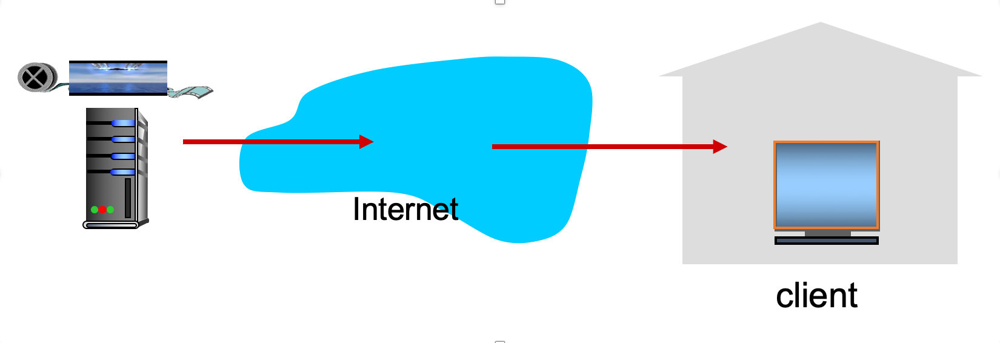

* Main challenge:
    * server-to-client bandwidth will vary over time, with changing network congestion levels (in house, in access network, in network core, at video server)
    * packet loss and delay due to congestion will delay play-out, or result in poor video quality

    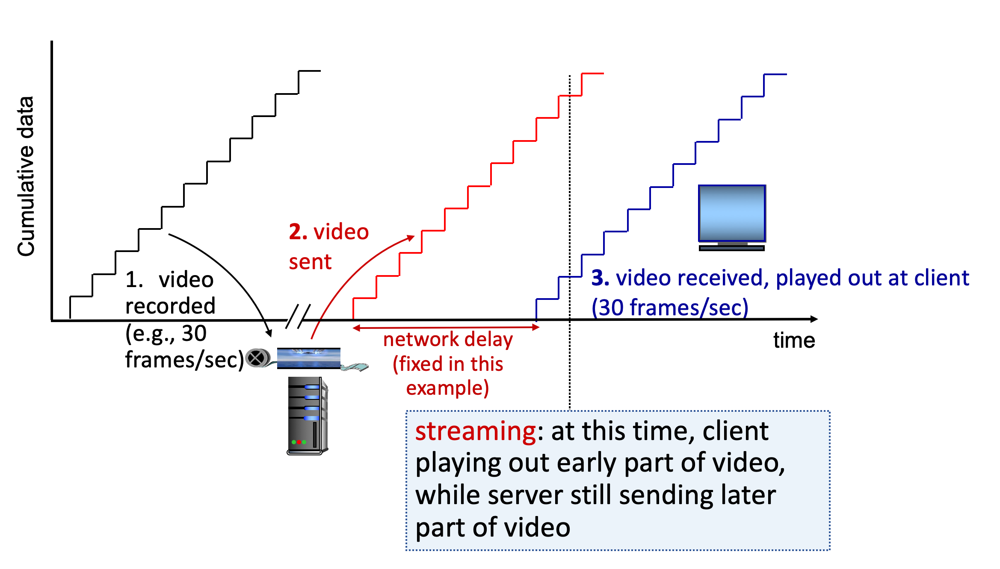

* continuous play-out constraint: once client play-out begins, play-back must match original timing
    * but network delays are variable (jitter), so will need client-side buffer to match play-out requirements
* other challenges:
    * client interactivity: pause, fast-forward, rewind, jump through video
    * video packets may be lost, retransmitted

### Playout buffering: For solving jitter issue

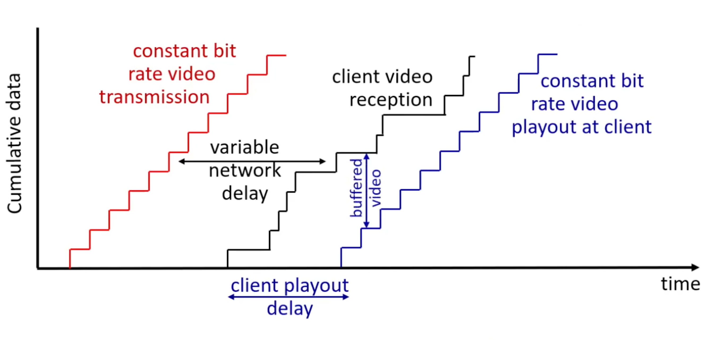

* client-side buffering and playout delay:
    * compensate for network-added delay, delay jitter

### Streaming multimedia: DASH

`DASH`: Dynamic, Adaptive Streaming over HTTP

* server:
    * divides video file into multiple chunks
    * each chunk stored, encoded at different rates
    * `manifest file`: provides URLs for different chunks

* client:
    * periodically measures server-to-client bandwidth
    * consulting manifest, requests one chunk at a time
        * chooses maximum coding rate sustainable given current bandwidth
        * can choose different coding rates at different points in time (depending on available bandwidth at time)

* `intelligence at client` - client determines:
    * `when` to request chunk (so that buffer starvation, or overflow does not occur)
    * `what encoding rate` to request (higher quality when more bandwidth available)
    * `where` to request chunk (can request from URL server that is "close" to client or has high available bandwidth)

* `Streaming video` = encoding + DASH + play-out buffering

---
### Content distribution networks (CDNs)

`Challenge`
* How to stream content (selected from million of videos) to hundreds of thousands of simultaneous(同時的) users?

* `solution`: store/serve multiple copies of videos at multiple geographically distributed sites (`CDN`)
    * `enter deep`:push CDN servers deep into many access networks
        * close to users
        * Akamai (A server service provider): 240,000 servers deployed in more than 120 countries (2015)
    * `bring home`: smaller number (10's) of larger clusters in POPs near (but not within) access networks
        * used by Limelight

    * this is known as `OTT (over the top)` service

* `OTT challenges`: copying with a congested Internet
    * from which CDN node to retrieve content?
    * viewer behavior in presence of congestion?
    * what content to place in which CDN node?
---
### CDN content access: a closer look

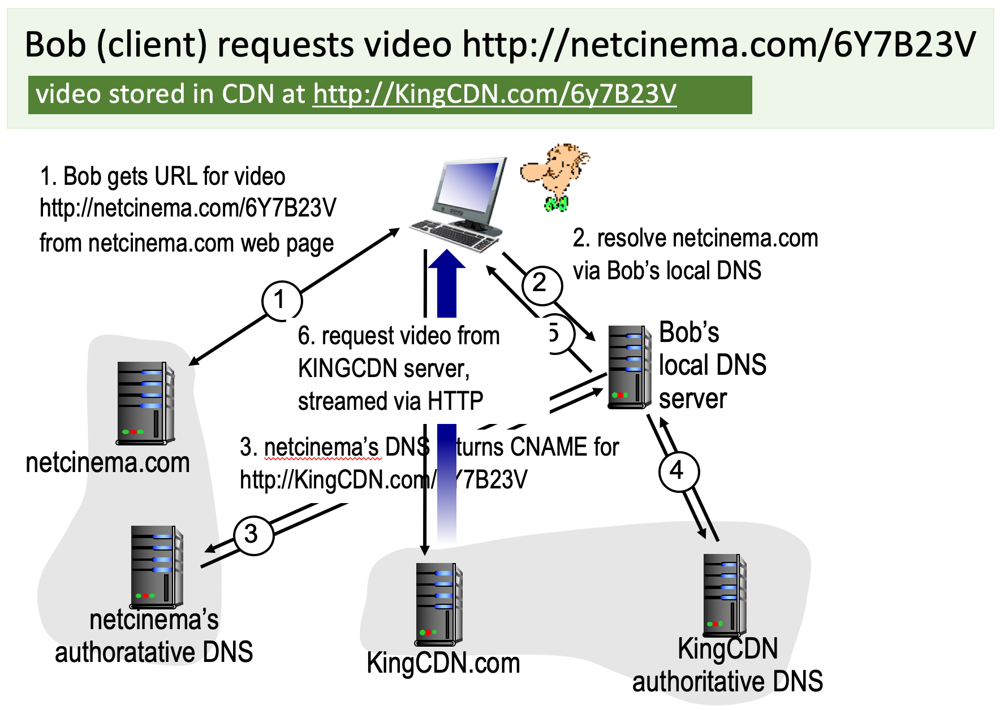

---
### CDN case: Netflix

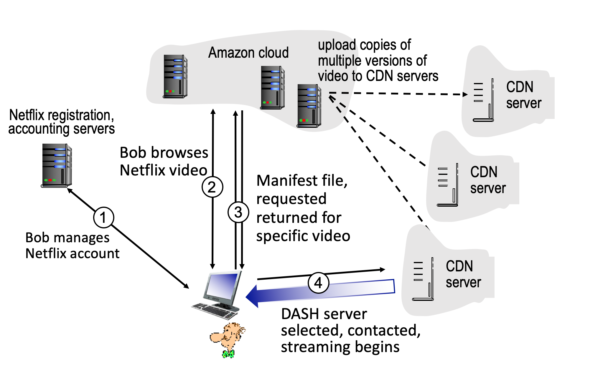

---
## XI. Socket programming

`Goal`: build client/server applications that communicate using sockets

* `socket`: door between application process and end-end-transport protocol

    

* Two socket type for two transport services:
    * `UDP`: unreliable datagram
    * `TCP`: reliable, byte stream-oriented

* Example

    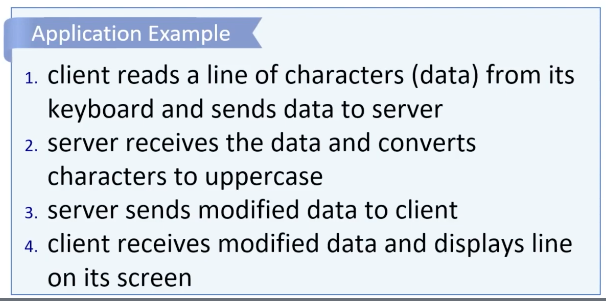

---
### Socket programming with UDP

* `UDP: User Datagram Protocol`
* no "connection" between client & server
    * no handshaking before sending data
    * sender explicitly attaches IP destination address and port # to each packet
    * receiver extracts sender IP address and port # from received packet
* transmitted data may be lost or received out-of-order
* Application viewpoint
    * UDP provides unreliable transfer of groups of bytes ("datagram") between client and server

`When we talk about client-server data transport, server usually would be the one stands by for the request`

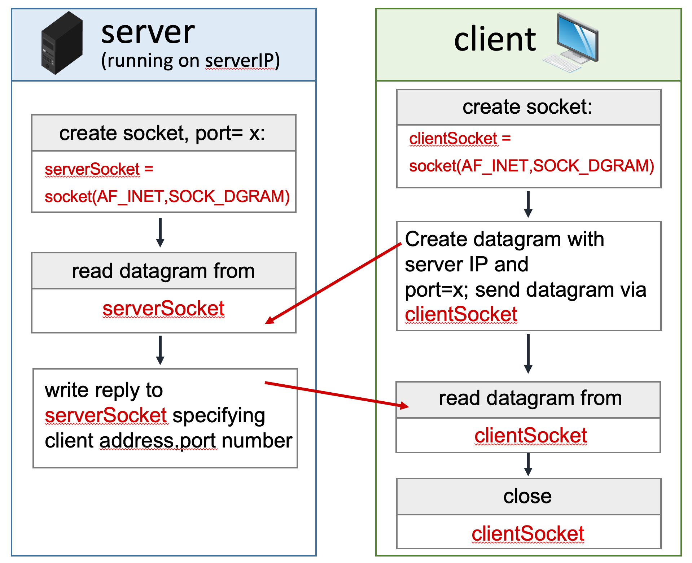

1. server build a socket
    * specify the port #
    * `AF_INET`: Using IPv4
    * `SOCK_DGRAM`: Datagram Socket (UDP)

2. client build a socket

3. sending datagram by client
    * Create datagram with server IP and port #
    * send datagram via client socket

4. server reads datagram from server socket
5. server write reply to server socket specifying client address, port #
6. client read datagram from client socket
7. client close client socket

---
### Socket programming with TCP

* `TCP: Transmission Control Protocol`
* Client must contact server
    * server process must first be running
    * server must have created socket(door/window) that welcomes client's contact

* Client contacts server by:
    * creating TCP socket, specifying IP address, port # of server process
    * when client creates socket: client TCP establishes connection to server TCP

* when being contacted by client, server TCP creates new connection socket for server process to communicate with that particular client
    * allow server to talk with multiple clients
    * source port # used to distinguish clients

* Application view
    * TCP provides reliable, in-order byte-stream transfer ("pipe") between client and server
    * If packet loss occurs, TCP will automatically retransfer the packet.

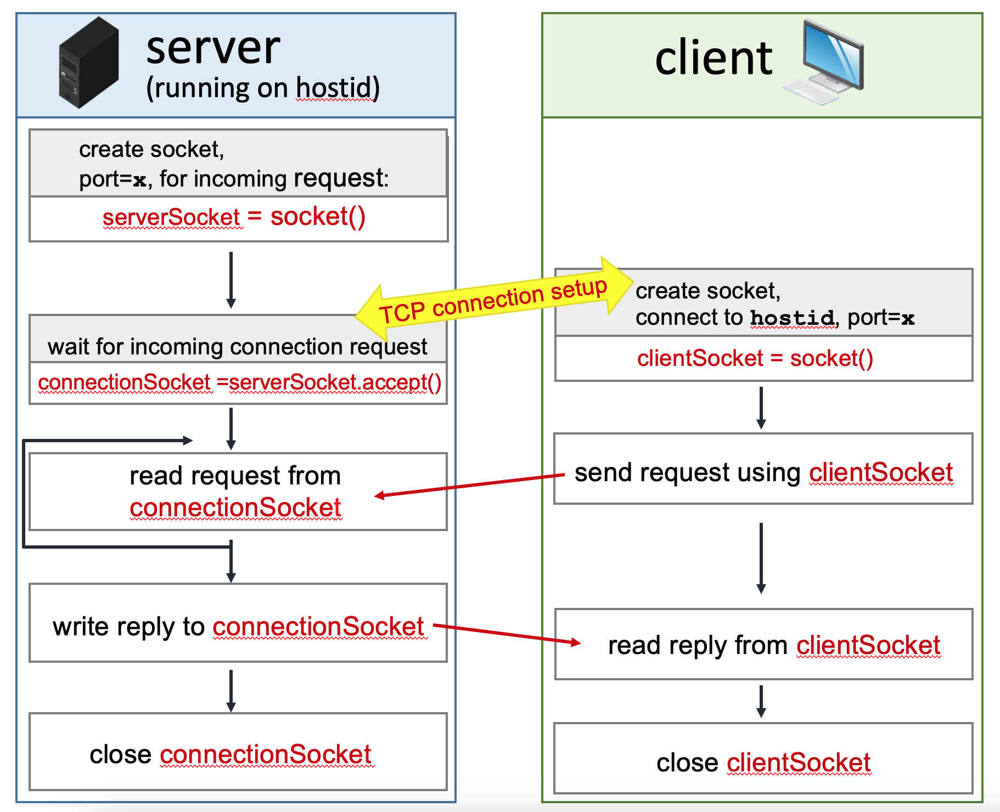