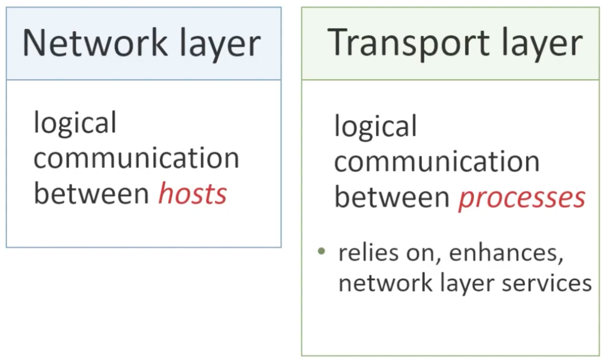
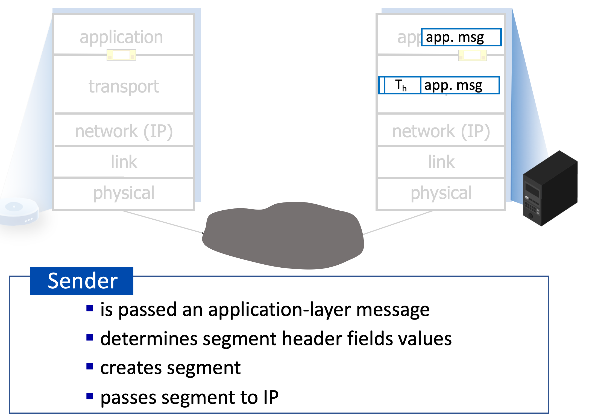
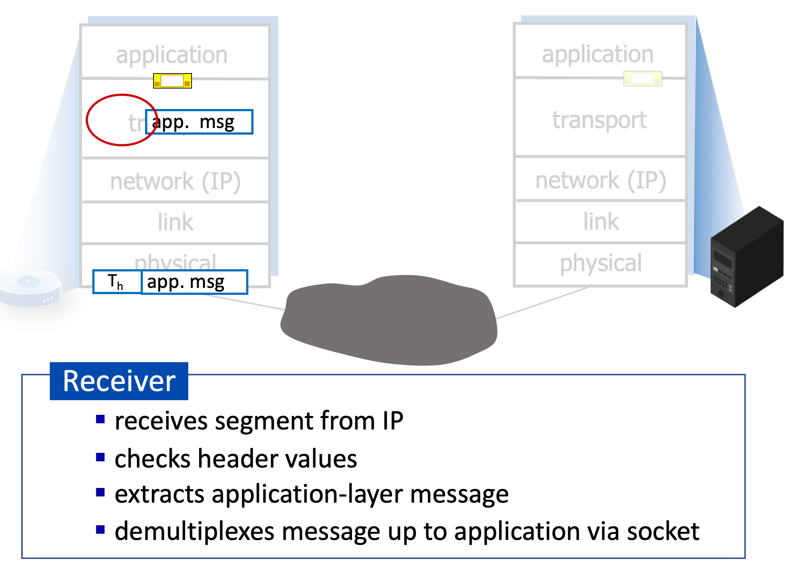

# 3.I.A. Intro to Transport layer

## Transport services and protocols

### provide `logical communication` between application processes running on different hosts

* transport protocols actions in end systems:
    * sender: breaks application messages into segments, passes to network layer
    * receiver: reassembles segments into messages, passes to application layer

* two transport protocols available to Internet applications
    * TCP, UDP
---
## Transport versus network layer services and protocols

---
## Transport Layer Actions

---
## Two principal Internet transport protocols

* `TCP`: Transmission Control Protocol
    * reliable, in-order delivery
    * congestion control (for sending / control the transmission speed to prevent network jam)
    * flow control (for receiving / control the transmission speed to prevent network jam)
    * connection setup
    * much more complex than `UDP`

* `UDP`: User Datagram Protocol
    * unreliable, unordered delivery
    * no-frills extension of "best-effort" IP

* services not available
    * delay guarantees
    * bandwidth guarantees