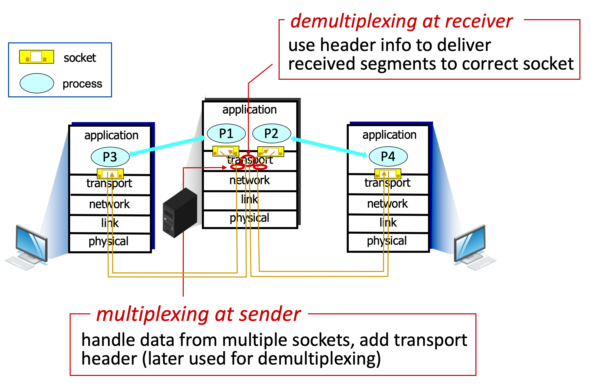
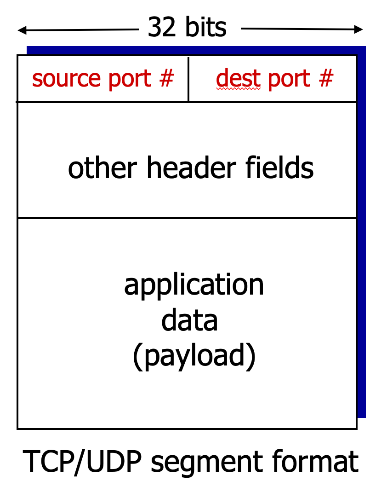
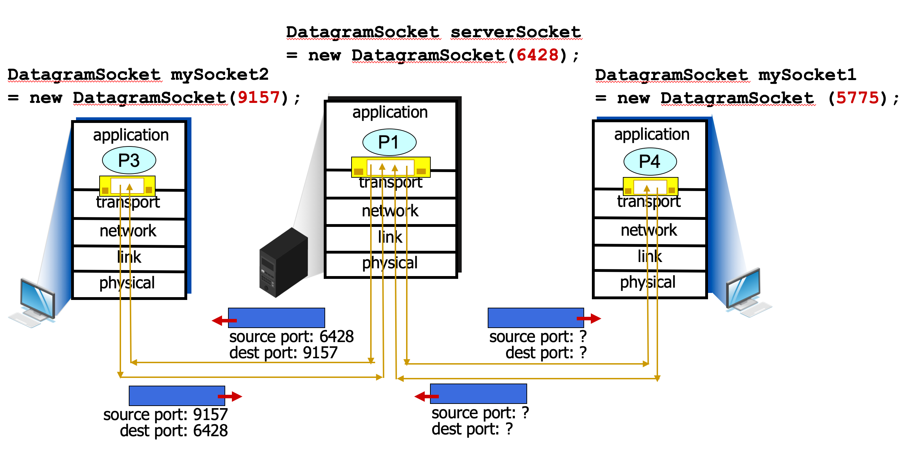

# 3.I.B. Multiplexing And Demultiplexing

---
## How demultiplexing works?

* host receives IP datagrams
    * each datagram has source IP address, destination IP address
    * each datagram carries one transport-layer segment
    * each segment has source, destination port number

* host uses `IP addresses & port numbers` to direct segment to appropriate socket

    

---
## Connection-oriented demultiplexing

* TCP socket identified by 4-tuple:
    * source IP address
    * source port number
    * dest IP address
    * dest port number

* demux: receiver uses `all four values` (4-tuple) to direct segment to appropriate socket
* server may support many simultaneous TCP sockets:
    * each socket identified by its own 4-tuple
    * each socket associated with a different connecting client

