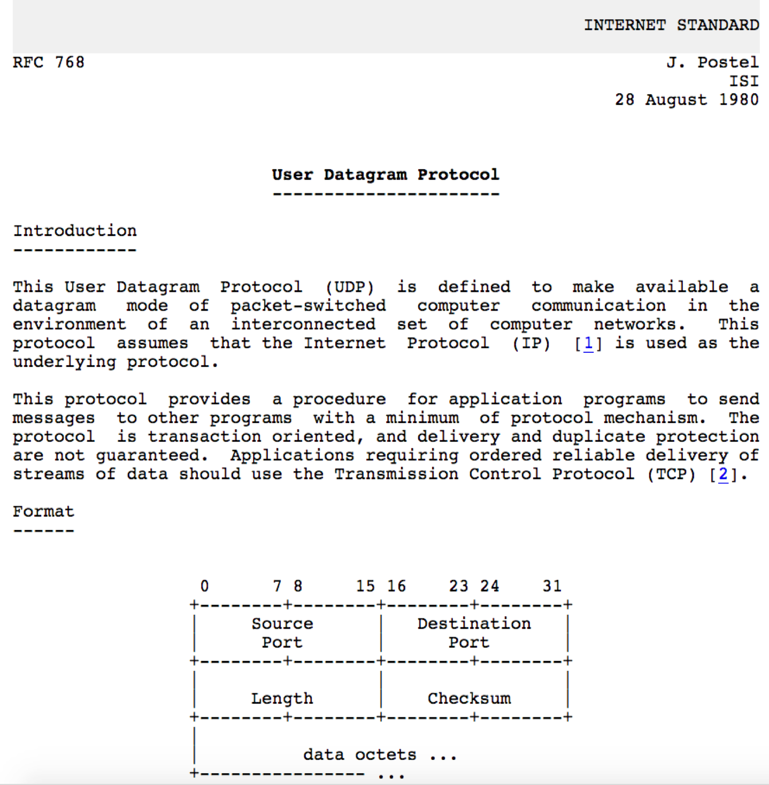
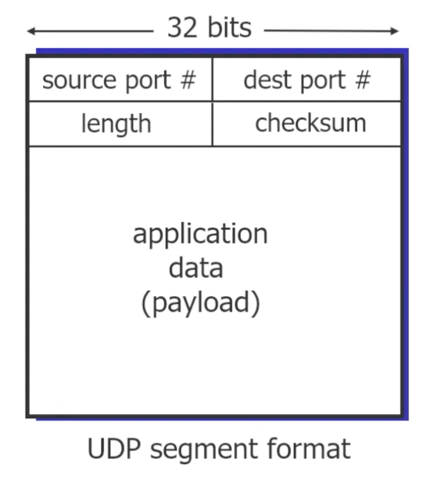
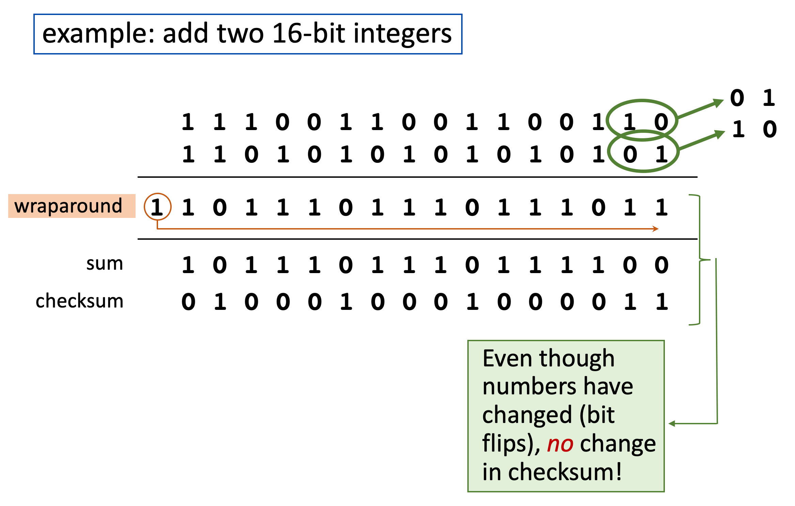

# 3.II. User Datagram Protocol (UDP)

## UDP: User Datagram Protocol

* "no frills", "bare bones" Internet transport protocol

* "best effort" service, UDP segments may be:
    * lost
    * delivered out-of-order to app

* `connection-less`
    * no handshaking between UDP sender, receiver
    * each UDP segment handled independently of others
---
### Why is there a UDP?

* no connection establishment (save time cost of RTT delay)
* simple: no connection state at sender, receiver
* small header size
* no congestion control
    * UDP can blast away as fast as desired
    * can function in the face of congestion
---
## Application of UDP
* UDP use:
    * streaming multimedia apps (loss tolerant, rate sensitive)
    * DNS
    * SNMP
    * HTTP/3

* If reliable transfer needed over UDP (e.g., HTTP/3)
    * add needed reliability at application layer
    * add congestion control at application layer
---
## UDP RFC 768

---
## UDP segment format

* header:
    * source port #: 0~65535
    * dest port #: 0~65535
    * length: in bytes of UDP segment, including header. 0~65535
    * checksum: 0~65535. 
* application data

---
## Checksum

* It is utilized to check whether the data is transferred correctly.
* Could be closed, denote zero, for high speed rate purpose. 
* The checksum denoted in the header ,calculated by sender, should be same to calculated by receiver. 
* The calculation depends on four elements:
    * Pseudo Header - containing:
        * source IP: denoted in IP header
        * dest IP: denoted in IP header
        * Unused: a 8-bit zero
        * Protocol: denoted in IP header
        * Length: denoted in UDP header
    * UDP Header
    * UDP Data
    * Padding: Padding of result if result of checksum calculation is not a multiple of 2 Byte

* calculate example
    
---
## Summary: UDP

* "no frills" protocol:
    * segments may be lost, delivered out of order
    * best effort service: "send and hope for the best"
* UDP has its advantage:
    * no setup/handshaking needed (no RTT incurred)
    * can function when network service is compromised
    * helps with reliability (checksum)