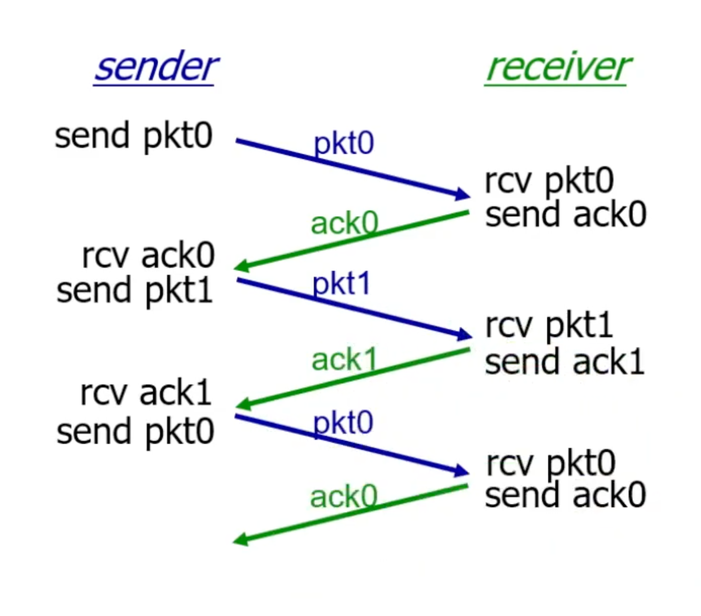
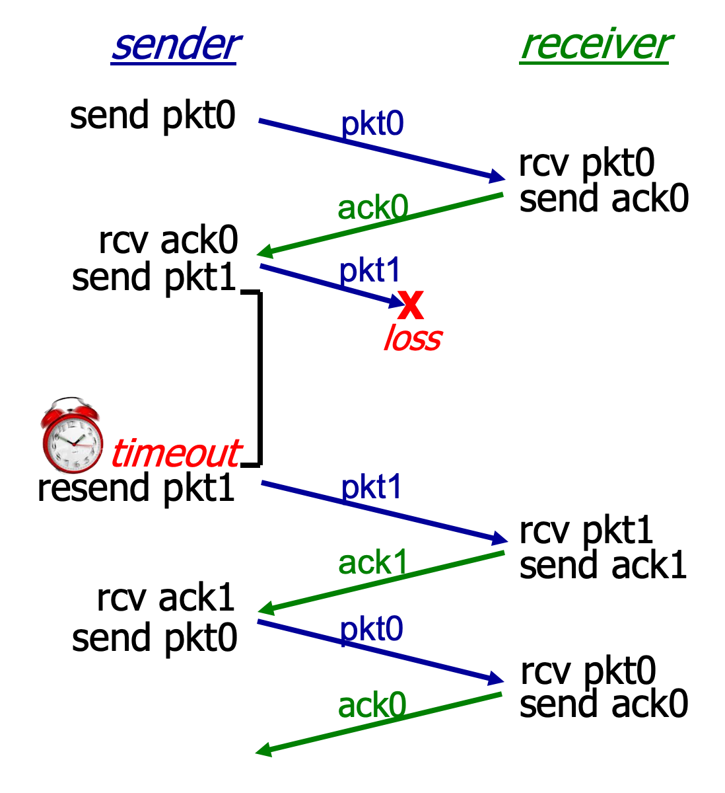

# 3.III.A. Reliable Data Transfer

## Principle of reliable data transfer
* In the real world
    

---
## rdt2.0: channel with bit errors

* underlying channel may flip bits in packet
    * checksum to detect bit errors

### Question: how to recover from errors?
* acknowledgements (ACKs): receiver explicitly tells sender that pkt received OK.
* negative acknowledgements (NAKs): receiver explicitly tells sender that pkt had errors
* sender retransmits pkt on receipt of NAK
    * stop and wait: sender sends one pkt, then waits for receiver response

### rdt2.0 has a fatal(致命的) flaw(缺陷)
* what happens if ACK/NAK corrupted?
    * sender doesn't know what happened at receiver
    * can't just retransmit: possible duplicate
* handling duplicates:
    * sender retransmits current pkt if ACK/NAK corrupted
    * sender adds `sequence number` to each pkt
    * receiver discards (doesn't deliver up) duplicate pkt
---
## rdt3.0: channel with errors and loss

* `New channel assumption`: underlying channel can also lose packets (data, ACKs)
    * checksum, sequence #s, ACKs, retransmissions will be of help...but not quite enough

### Question: how do human handle lost sender-to-receiver words in conversation?

### `Approach:` sender waits "reasonable" amount of time for ACK
* retransmits if no ACK received in this time
* if pkt (or ACK) just delayed (not lost):
    * retransmission will be duplicate, but seq#s already handles this
    * receiver must specify seq # of packet being ACKed
* use countdown timer to interrupt after "reasonable" amount of time
* illustration
    * no loss
        
    * packet loss
        
    * ACK loss
        
    * premature timeout/delayed ACK (Uncommon)
        

### rdt3.0: stop-and-wait operation

* Total time of transfer a packet = ${RTT + {L \over R}}$
* Poor efficiency

### rdt3.0: pipelined protocols operation

* `pipelining:` sender allows multiple, "in-flight", yet-to-be-acknowledged packets
    * range of sequence numbers must be increased
    * buffering at sender and/or receiver

