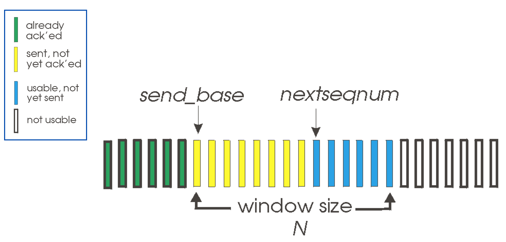
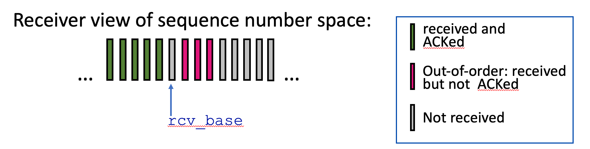
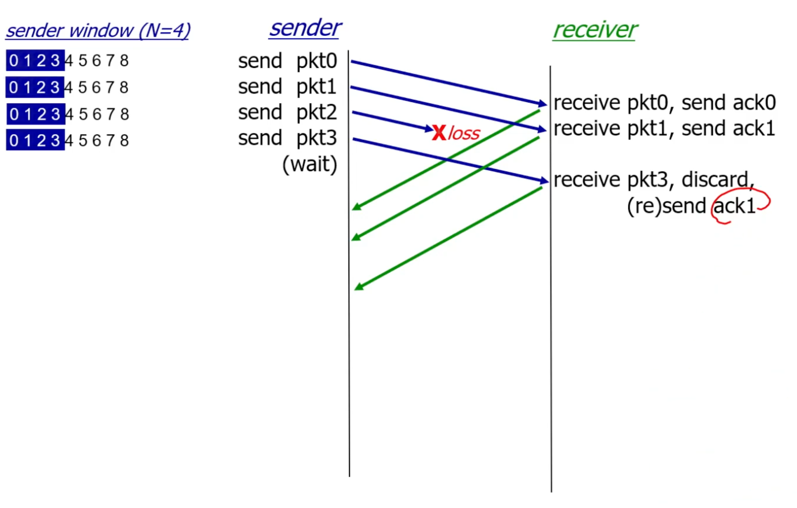
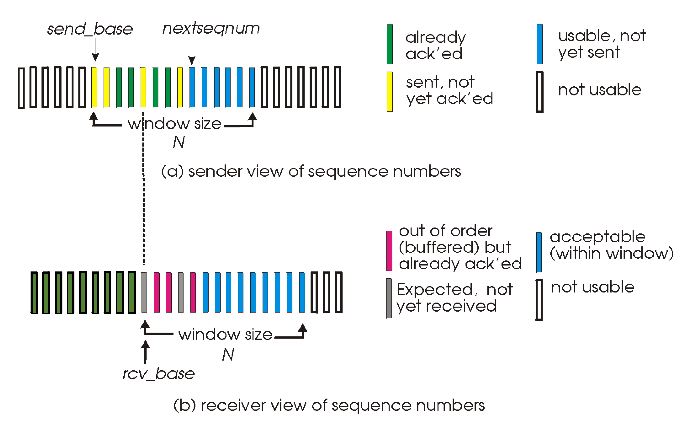
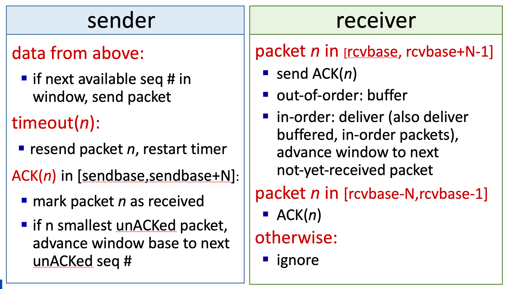
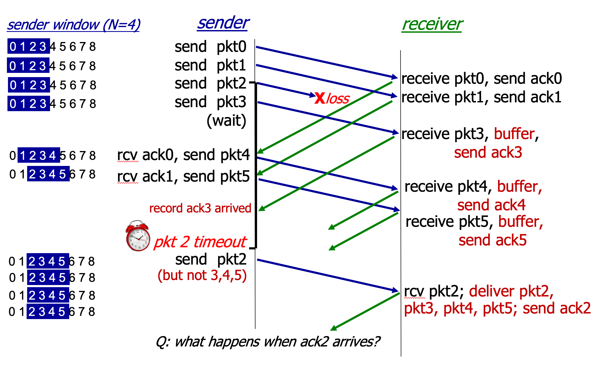

# 3.III.B. ACK Mechanism

## Go-Back-N
### Go-Back-N: sender

* sender: "window" of up to N, consecutive transmitted but unACKed pkts
    * k-bit seq # in pkt header

    

* `cumulative ACK:` ACK(n):ACKs all packets up to, including seq # n
    * on receiving ACK(n): move window forward to begin at n + 1
* timer for oldest in-flight packet
* timeout(n): retransmit packet n and all higher seq # packets in window

### Go-Back-N: receiver

* ACK-only: always send ACK for correctly-received packet so far, with highest `in-order` seq #
    * may generate duplicate ACKs
    * need only remember rcv_base
* on receipt of out-of-order packet:
    * can discard (don't buffer) or buffer: an implementation decision
    * re-ACK pkt with highest in-order seq #

    

### Go-Back-N: Illustration

---
## Selective ACK

* receiver individually acknowledges all correctly received packets
    * may generate duplicate ACKs
    * need only remember rcv_base

* sender times-out/retransmits individually for for unACKed packets
    * sender maintain timer for each unACKed pkt

* sender window
    * N consecutive seq #s
    * limit seq #s of sent, unACKed packets

### Selective ACK Illustration
