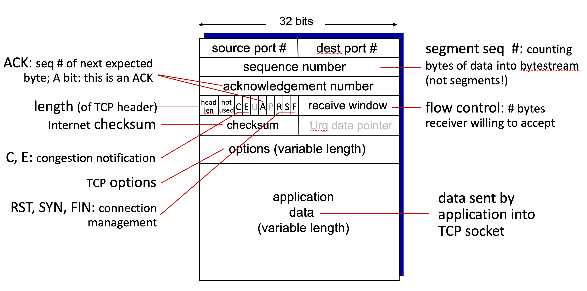
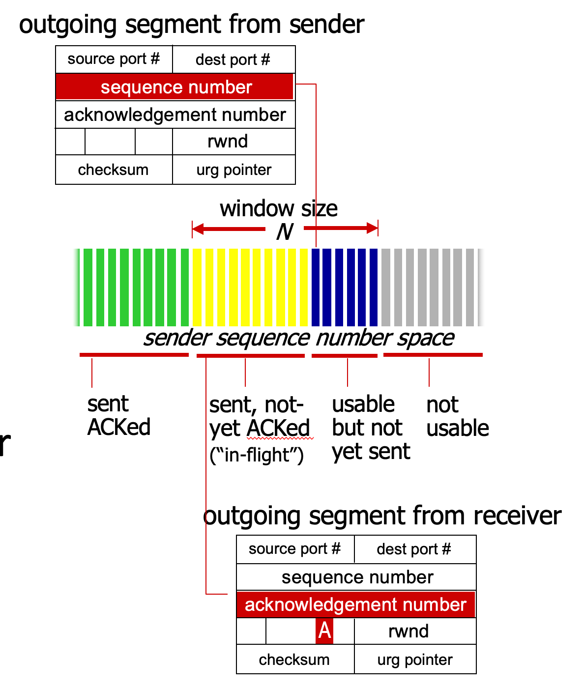
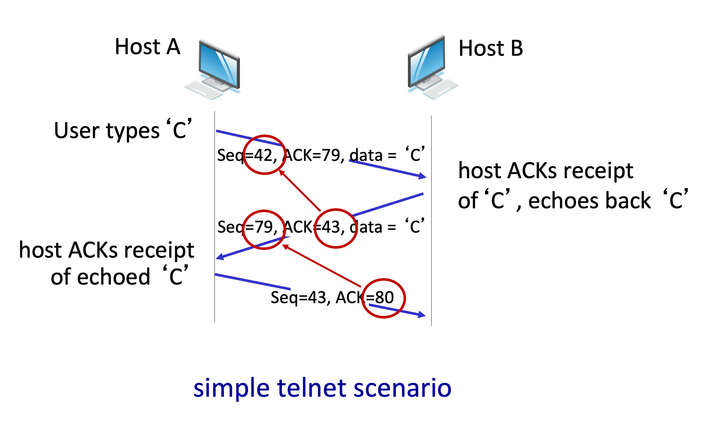

# 3.IV. TCP overview

* RFCs: 793, 1122, 2018, 5681, 7323
* point-to-point:
    * one sender, one receiver
* reliable, in-order byte stream:
    * no "message boundaries"
* full duplex data:
    * bi-directional data flow in same connection
    * MSS: maximum segment size
* cumulative ACKs
* pipelining:
    * TCP congestion and flow control set window size
* connection-oriented:
    * handshaking (exchange of control messages) initializes sender, receiver state before data exchange
* flow controlled:
    * sender will not overwhelm receiver

## Segment structure

* generally, except the first packet, all packets are ACK packets.
* the last packet might be ACK packet without bringing data.
* the calculation method of checksum is almost same to UDP's. The only different part is that only UDP can turn off the checksum function with specifying checksum to zero.
* Header of TCP segment takes 20 byte (5 * 32 bit), without options, at least.

---
## TCP sequence numbers, ACKs

### Sequence numbers:
* byte stream "number" of first byte in segment's data

### Acknowledgements:
* seq # of `next byte` expected from other side
* cumulative ACK

### Question: How receiver handles out-of-order segments?
* up to implementor

### Illustration

