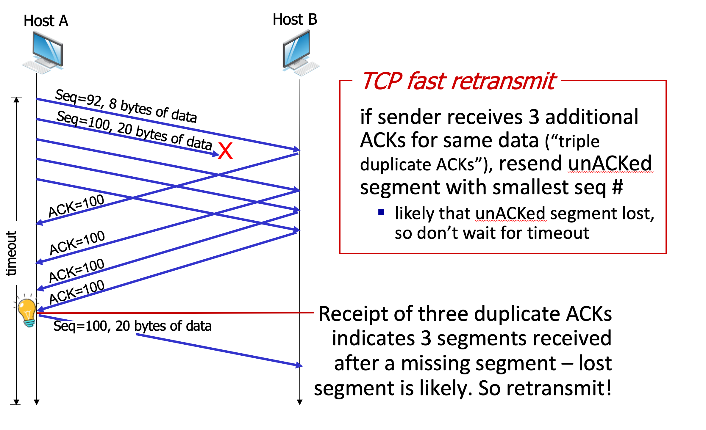

# 3.V. TCP timeout

## TCP round trip time (RTT), timeout
### Question: How to set TCP timeout value?
* longer than RTT, but RTT varies...
* `too short`: premature(過早的) timeout, unnecessary retransmissions
* `too long`: slow reaction to segment loss
### Further issue: How to estimate RTT?
* SampleRTT: measured time from segment transmission until ACK receipt
    * `ignore retransmissions`
* SampleRTT will vary, want estimated RTT `smoother`
    * average several recent measurements, not just current SampleRTT
    * recent RTT is more valuable than historic RTT -> moving average
### EWMA
* Exponential weighted moving average (EWMA)
* ${EstimatedRTT_t = (1-\alpha) \times EstimatedRTT_{t-1} + \alpha \times SampleRTT_{t}}$
* influence of past sample decreased exponentially fast
* typical weight ${\alpha = 0.125}$
### Timeout interval
* timeout interval: estimated RTT plus `safety margin`
* large variation in estimated RTT -> larger safety margin
* ${TimeoutInterval = EstimatedRTT + 4 \times \sigma _{RTT}}$
* ${\sigma _{RTT_{t}} = (1-\beta)\times\sigma _{RTT_{t-1}} + \beta \times |SampleRTT - EstimatedRTT|}$
* typical weight $\beta = 0.25$
---
## TCP Sender (simplified)

### event: data received from application
* create segment with seq #
* seq # is byte-stream number of first data byte in segment
* start timer if not already running
    * think of timer as for oldest unACKed segment
    * expiration interval: TimeOutInterval

### event: timeout
* retransmit segment that caused timeout
* restart timer

### event: ACK received
* if ACK acknowledges previously unACKed segments
    * update what is known to be ACKed
    * start timer if there are still unACKed segments
---
## TCP fast retransmit

