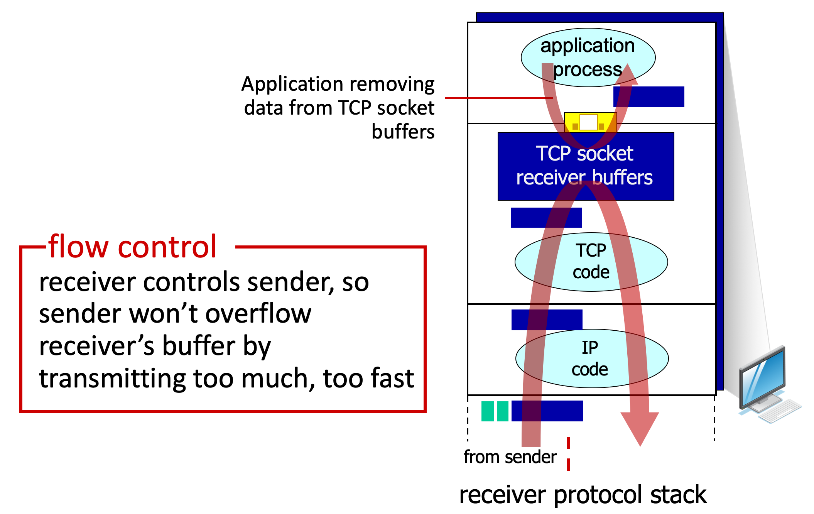
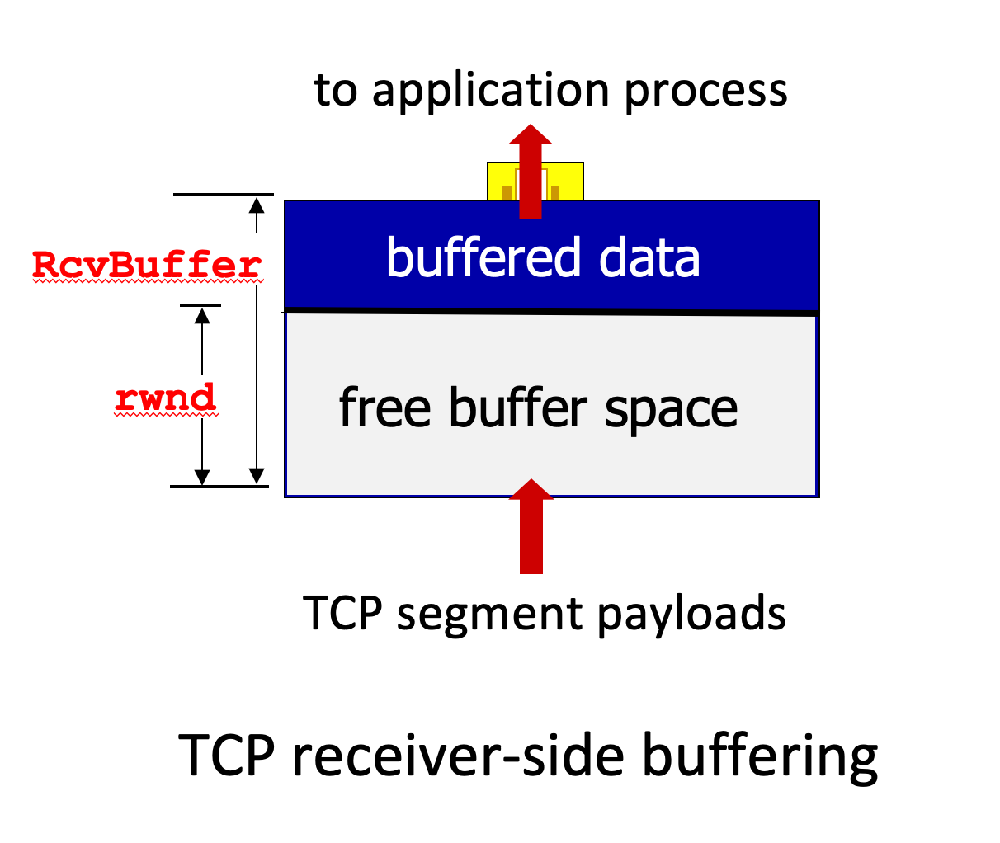
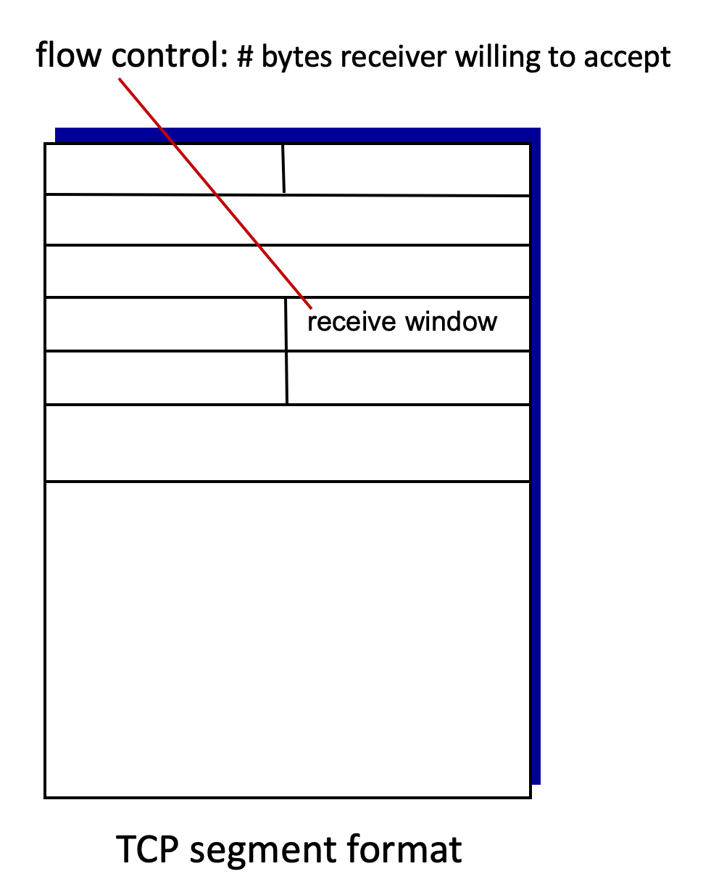
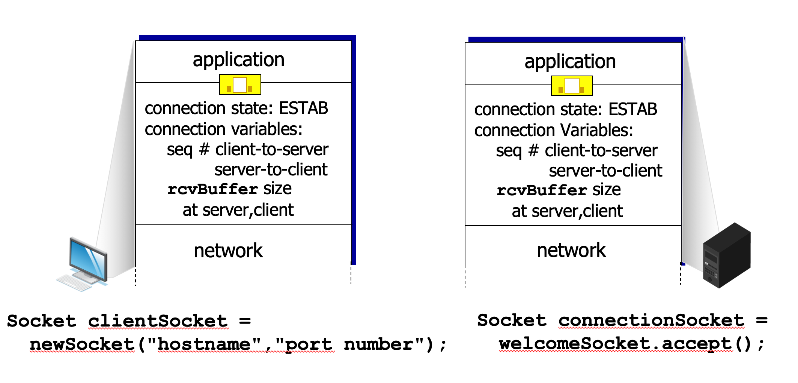
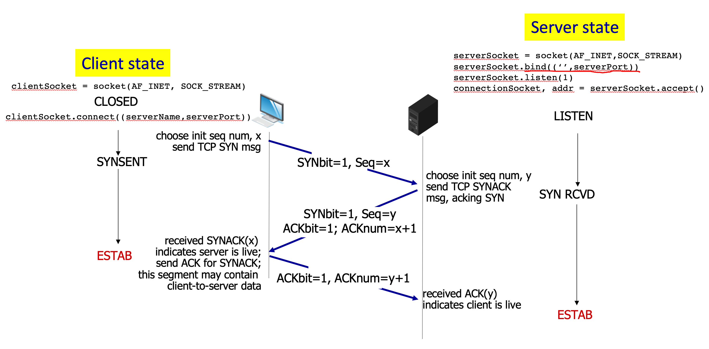
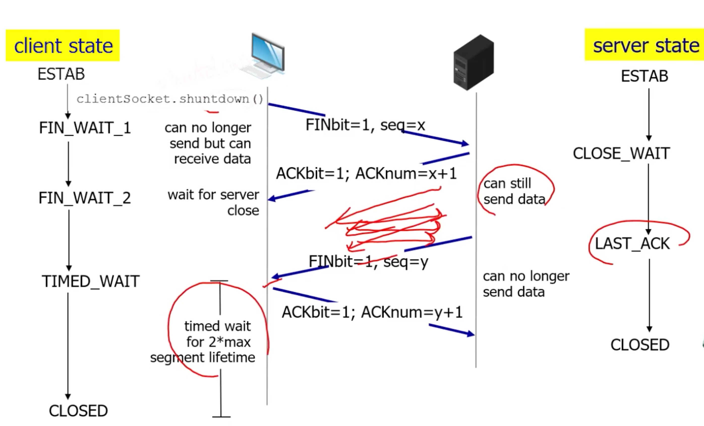

# 3.VI. TCP Connection Management

## TCP flow control

### Question: What happens if network layer delivers data faster than application layer removes data from socket buffer?

* rwnd = receiver window
* TCP receiver "advertises" free buffer space in rwnd field in TCP header
    * `RcvBuffer` size set via socket options (typical default is 4096 bytes)
    * many operating systems auto-adjust RcvBuffer

* sender limits amount of unACKed("in-flight") data to rwnd

* guarantees receive buffer will not overflow

---

## Handshake

### before exchanging data, sender/receiver "handshake":
* agree to establish connection (each knowing the other willing to establish connection)
* agree on connection parameters (e.g., starting seq #s)

### 3-way handshake

1. first way: `client` send `SYN msg`
    * SYNbit = 1 means "would like to establish connection"
    * For safety reason, seq # begins randomly, not from zero.
2. second way: `server` send `TCP SYNACK`
    * ACKbit = 1 means "this is an acknowledge packet"
    * ACKnum = x + 1 means "next seq# of received packet"
3. third way: `client` send `ACK for SYNACK`
    * this segment may contain client-to-server data

* takes about 200 millisecond to accomplish handshake

---
## closing a TCP connection

1. client send segment with FINbit=1
2. client remains receiving segment from server and wait for server close
3. server send segment with FINbit=1 after sending last data packet
4. client send ACK to server and wait for 2 ${\times max\{SegmentLifetime\}}$ (about 1~2 min)
5. complete closing