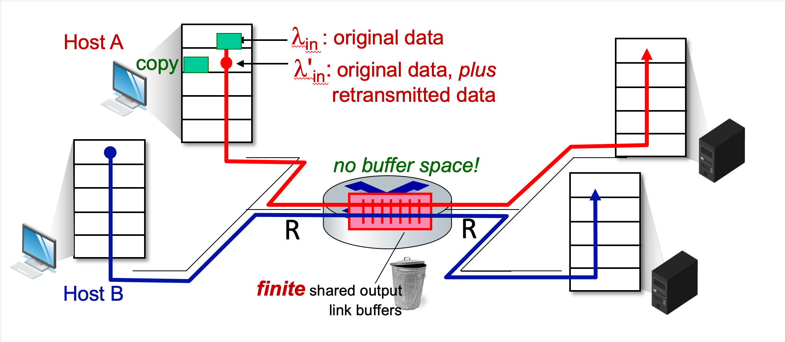

# 3.VII. Principle of Congestion Control

## `Congestion`(擁塞)
* `"too many senders, sending too fast"`
* manifestations（表現形式）:
    * long delays
    * packet loss
* different from flow control (`"one sender too fast for one receiver(buffer out of memory)"`)!
* a top-10 problem
---
### Simple scenario

* one router, infinite buffers
* input, out link capacity: R
* two flows
* no retransmissions needed
---
### Get close to real world

* one router, finite buffers
* sender retransmits lost, timed-out packet
    * application-layer input = application-layer output ${\lambda _{in} = \lambda _{out}}$
    * transport-layer input includes retransmissions: ${\lambda ^\prime _{in} \geq \lambda _{in}}$
---
### Idealization: Perfect Knowledge

* sender sends only when router buffers available
---
### Idealization: Some Perfect Knowledge

* packets can be lost (dropped at router) due to full buffers
* sender knows when packet has been dropped: only resends if packet known to be lost
    
---
### Realistic scenario: `un-needed duplicates`

* packets can be lost, dropped at router due to full buffers - requiring retransmissions
* but sender times can time out prematurely, sending two copies, both of which are delivered
    

---
## costs of congestion
* more work (retransmission) for given receiver throughput
* unneeded retransmissions: link carries multiple copies of a packet
    * decreasing maximum achievable throughput

---
## Way for congestion control

### `End-end congestion control`

* no explicit feedback from network
* congestion `inferred（推斷）` from observed loss, delay
* approach taken by TCP

### `Network-assisted congestion control`

* router provide `direct` feedback to sending/receiving hosts with flows passing through congested router
* may indicate congestion level or explicitly set sending rate
* TCP ECN, ATM, DECbit protocols