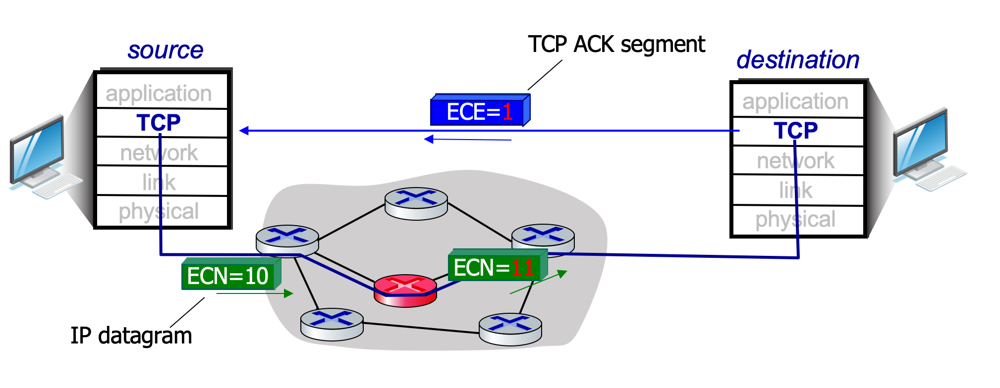

# 3.VIII.A TCP Congestion Control

## TCP Congestion Control: `AIMD`
* `approach:` senders can increase sending rate until packet loss/congestion occurs, then decrease sending rate on loss event
### `Addictive Increase`
* increase sending rate by 1 maximum segment size every RTT until loss detected
### `Multiplicative Decrease`
* cut sending rate in half at each loss event

## AIMD: more

### `Multiplicative decrease` detail: sending rate is
* Cut in half on loss detected by triple duplicate ACK (TCP Reno)
* Cut to 1 MSS (Maximum segment size) when loss detected by timeout (TCP Tahoe)

### AIMD - a distributed, asynchronous algorithm - has been shown to:
* optimize congested flow rates network wide
* have desirable stability properties

---
## TCP congestion control: details

* ${cwnd}$: congestion window size
* TCP sender limits transmission: ${LastByteSent - LastByteAcked \leq cwnd}$
* ${cwnd}$ is dynamically adjusted in response to observed network congestion (implementing TCP congestion control)

### TCP sending behavior:

* roughly: send ${cwnd}$ bytes, wait RTT for ACKS, then send more bytes
* ${TCP\ rate \approx {cwnd \over RTT}\
 \ bytes/sec}$

 ---
 ## TCP slow start
 * when connection begins, increase rate exponentially until first loss event:
    * initially *cwnd* = 1 MSS (Maximum Segment Size)
    * double *cwnd* every RTT
    * done by incrementing *cwnd* for every ACK received

* `summary:` initial rate is low, but increase up exponentially fast
    

---
## From slow start to congestion avoidance

### `Question`: When should the exponential increase switch to linear?

*Ans*: when *cwnd* gets to 1/2 of estimated value before timeout.

### `Implementation:`
* variable **ssthresh**
* on loss event, *ssthresh* is set to 1/2 of **cwnd** just before loss event

---
## TCP congestion control

### TCP Reno
* slow start
* congestion avoidance
    * ${cwnd(t) = cwnd(t-1) + MSS \times{MSS\over cwnd}\ bytes}$
* fast recovery

---
## TCP CUBIC

### `Question`: Is there a better way than AIMD to "probe" for usable bandwidth?

* Insight/intuition:
    * ${W_{max}}$: sending rate at which congestion loss was detected
    * congestion state of bottleneck link probably hasn't changed much
    * after cutting rate/window in half on loss, initially ramp to ${W_{max}}$ faster, but then approach ${W_{max}}$ more slowly

    

### TCP CUBIC
* K: point in time when TCP window size will reach ${W_{max}}$
    * K itself is tuneable
* increase W as a function of the cube of the distance between current time and K
    * larger increases when further away from K
    * smaller increases (cautious) when nearer K
* TCP CUBIC default in Linux, most popular TCP for popular Web servers

---
## Delay-based TCP congestion control

* TCP increase sending rate until packet loss occurs at some router's output: the `bottleneck link`
* understanding congestion: useful to focus on congested `bottleneck link`
* `Goal`: Keeping sender-to-receiver pipe "just full enough, but no fuller"

### `Delay-based approach`:
* ${RTT_{min}}$: minimum observed RTT (un-congested path)
* un-congested throughput with congestion window **cwnd** is ${cwnd \over RTT_{min}}$
* measured throughput = ${BytesSentInLastRTTInterval \over RTT_{measured}}$
* pipeline
    * if measured throughput `very close` to un-congested throughput: increase **cwnd** linearly
    * else if measured throughput `far below` un-congested throughput: decrease **cwnd** linearly
### Property of Delay-based TCP congestion control
* congestion control without inducing/forcing loss
* maximizing throughput while keeping delay low
* a number of deployed TCPs take a delay-based approach
    * BBR deployed on Google's (internal) backbone network
---
## ECN (Explicit Congestion Notification)

TCP deployments often implement network-assisted congestion control:
* two bits in IP header (ToS field) marked by `network router` to indicate congestion
    * policy to determine marking chosen by network operator
* congestion indication is carried to destination
* `destination` sets `ECE` bit on ACK segment to notify sender of congestion
* involves both IP(IP header ECN bit marking) and TCP(TCP header C,E bit marking)

* ECN = 10 means to check the congestion state
* ECN = 11 means full buffer in current router
* ECE = 1 means congestion occurred in network

---
## TCP fairness

### `Fairness Goal`
If K TCP sessions share same bottleneck link of bandwidth R, each should have average rate of R/K

### `Question`: IS TCP Fair?

Example: two competing TCP sessions:
* additive increase gives slope of 1, as throughput increases
* multiplicative decrease decreases throughput proportionally

### `Ans`: Yes under idealized assumptions:
* same RTT
* fixed number of sessions only in congestion avoidance

---
### `Q`: Must all network apps be "fair"?

`Fairness and UDP`
* multimedia apps often do not use TCP
    * do not want rate throttled by congestion control
* instead use UDP:
    * send audio/video at constant rate, tolerate packet loss
* there is no "internet policy" policing use of congestion control
* plus: TCP friendly

