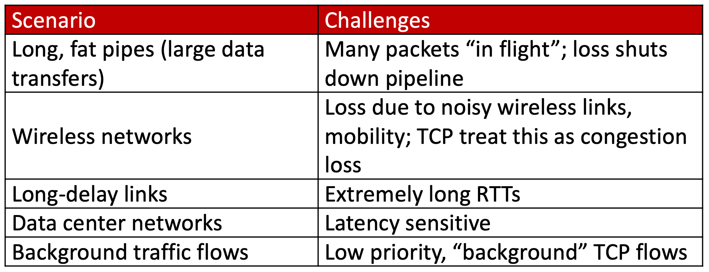
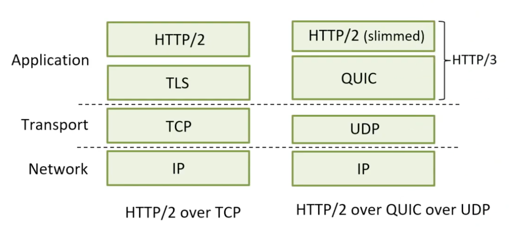
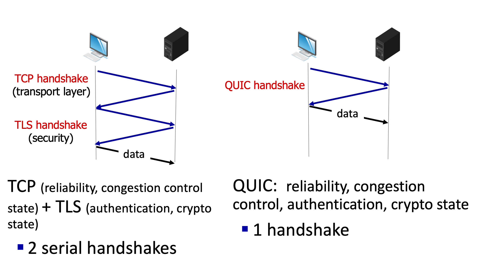

# 3.IX. Quick UDP Internet Connection (QUIC)

## Evolving transport-layer functionality

* TCP, UDP: principal transport protocols for 40 years
* different "flavors" of TCP developed, for specific scenarios:

* moving transport-layer function to application layer, on top of UDP
    * HTTP/3: QUIC

## QUIC: Quick UDP Internet Connections

* application-layer protocol, on top of UDP
    * increase performance of HTTP
    * deployed on many Google servers, apps(Chrome, mobile YouTube app)

* `error and congestion control`: "Readers familiar with TCP's loss detection and congestion control will find algorithms here that parallel well-known TCP ones." [from QUIC specification]
* `connection establishment`: reliability, congestion control, authentication, encryption, state established in one RTT

* multiple application-level "streams" multiplexed over single QUIC connection
    * separate reliable data transfer, security
    * common congestion control

### Connection establishment

