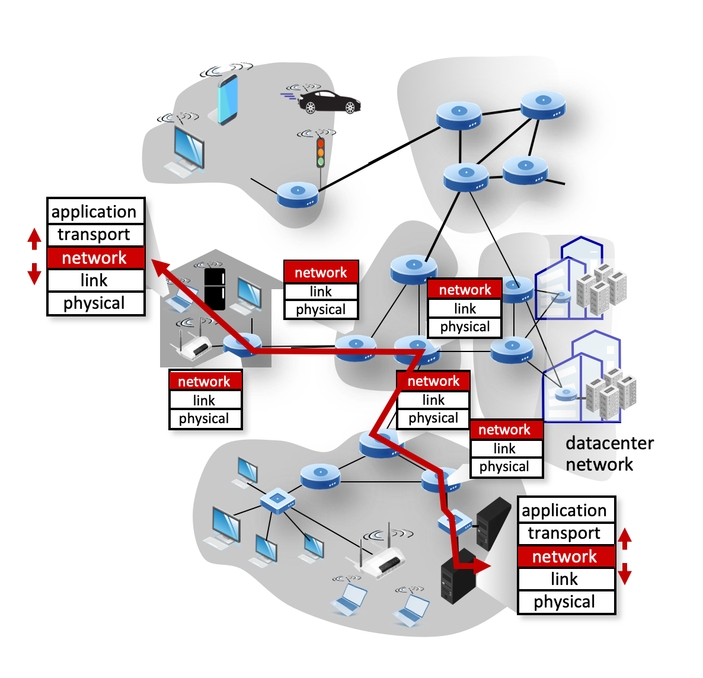
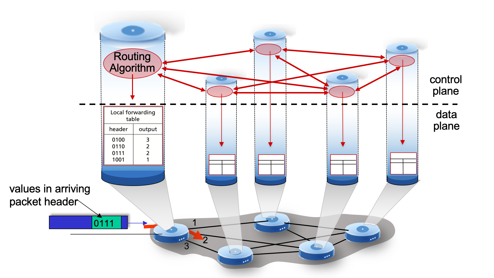
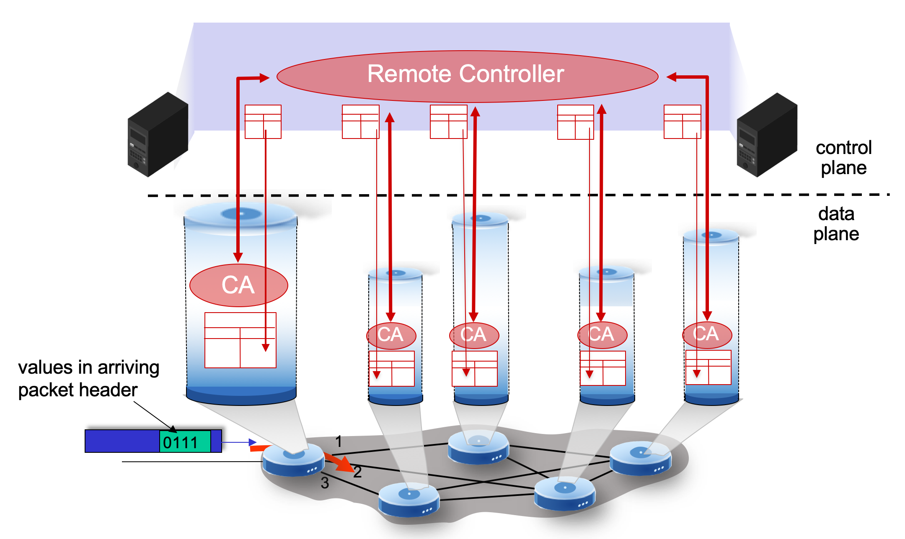
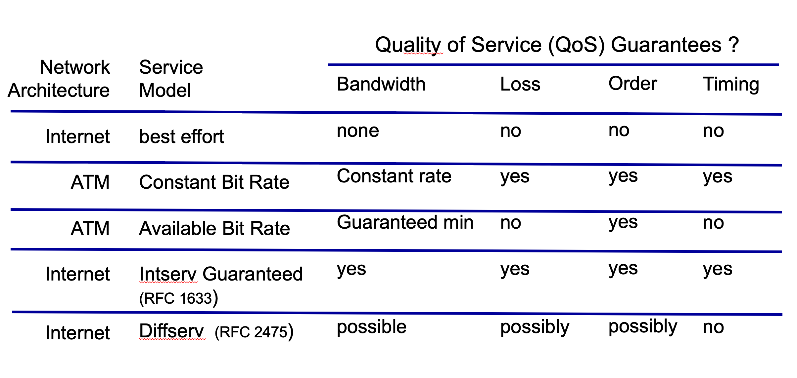

# 4.I. Network-layer services

## Network-layer services and protocols

* transport segment from sending to receiving host
    * sender: encapsulates segments into datagrams, passed to link layer
    * receiver: delivers segments to transport layer protocol

* `routers`:
    * will `not check headers of transport and application layer`
    * examines header fields in all IP datagrams passing through it
    * moves datagrams from input ports to output ports to transfer datagrams along end-end path

## Two key network-layer functions

`network-layer functions`
* forwarding: move packets from a router's input link to appropriate router output link
* routing: determine route taken by packets from source to destination
    * routing algorithm
    * routing will not be executed as frequently as forwarding (maybe half/one minute per once)

## Per-router control plane
* Individual routing algorithm components `in each and every router` interact in the control plane

## Software-Defined Networking (SDN) control plane

* Remote controller computes, installs forwarding tables in routers

## Network service model

### `Question`: What service model for "channel" transporting datagrams from sender to receiver?

`example services for individual datagrams:`
* guaranteed delivery
* guaranteed delivery with less than 40 msec delay

`example services for a flow of datagrams:`
* in-order datagram delivery
* guaranteed minimum bandwidth to flow
* restrictions on changes in inter-packet spacing

## Network-layer service layer

* However..."best effort" is still the major service model

### Reflections on best-effort service
* simplicity of mechanism has allowed Internet to be widely deployed adopted
* sufficient provision of bandwidth allows performance of real-time applications(e.g., interactive voice, video) to be "good enough" for "most of the time"
* `replicated, application-layer distributed services` (data-centers, content distribution networks) connecting close to clients' networks, allow services to be provided from multiple locations
* congestion control of "elastic" services helps