# 4.II Router Architecture

## high-level view of generic router architecture

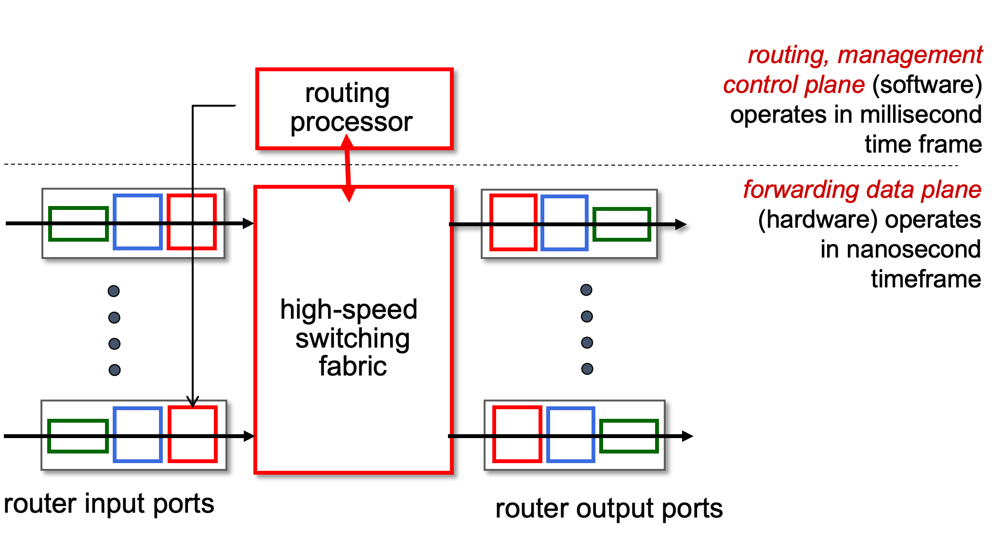

### Input port functions
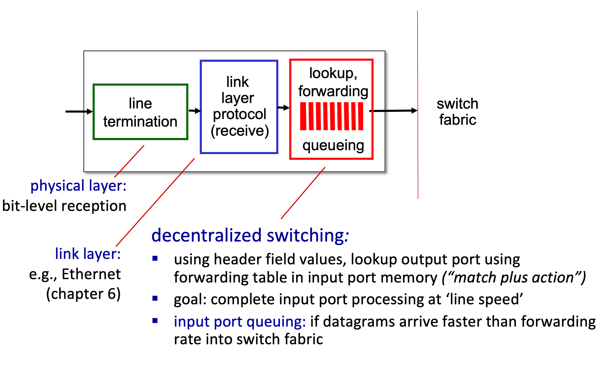

* switch fabric: examine each packet and determine its next destination/route

### Longest prefix matching

* When looking for forwarding table entry for given destination address, use `longest` address prefix that matches destination address.

* `Ans`: 0 and 1

* transport segment from sending to receiving host
* longest prefix matching: often performed using ternary(三元) content addressable memories (TCAMs)
    * content addressable: present address to TCAM. retrieve address in one clock cycle, regardless of table size
    * Cisco Catalyst: ~1M routing table entries in TCAM

---
## Switching fabrics

* transfer packet from input link to appropriate output link
* `switching rate`: rate at which packets can be transfer from inputs to outputs
    * often measured as multiple of input/output line rate
    * N inputs: switching rate N times line rate desirable

    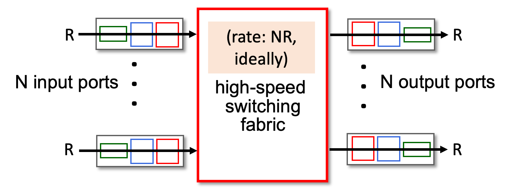

* three major types of switching fabrics
    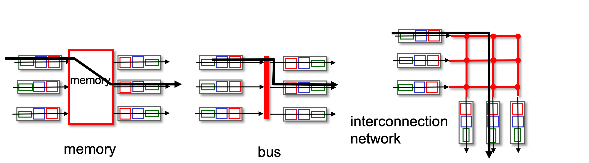

### Switching via memory
* traditional computers with switching under direct control of CPU
* packet copied to system's memory
* speed limited by memory bandwidth (2 bus crossings per datagram)
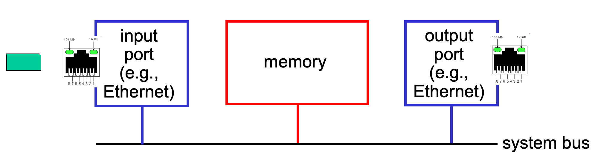

### Switching via bus
* datagram from input port memory to output port memory via a shared bus
* `bus contention`: switching speed limited by bus bandwidth
* 32 Gbps bus, Cisco 5600: sufficient speed for access routers
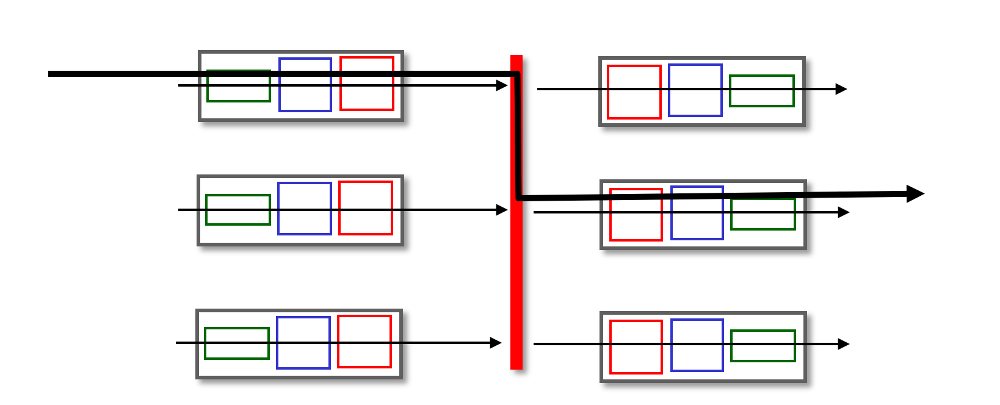

### Switching via interconnection network
* Crossbar, Clos networks, other interconnection nets initially developed to connect processors in multiprocessor
* `multistage switch`: ${n\times n}$ switch from multiple stages of smaller switches
* `exploiting parallelism`
    * fragment datagram into fixed length cells on entry
    * switch cells through the fabric, reassemble datagram at exit
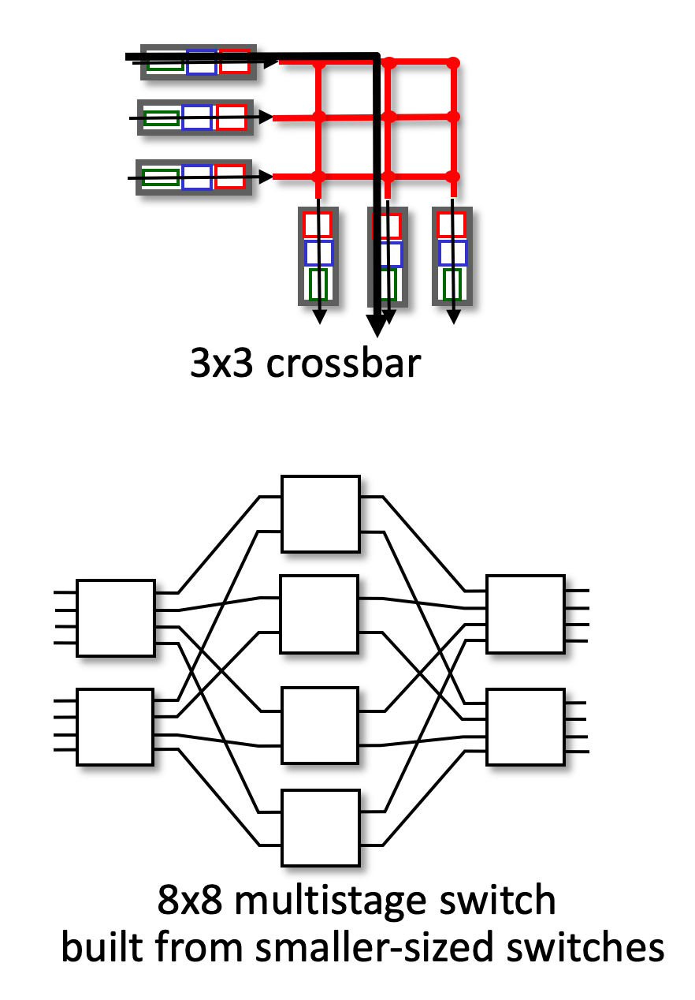

---
## Buffer Management

### Input port queuing

* If switch fabric slower than input ports combined -> queueing may occur at input queues
    * speedup, scale-up via parallelism

### `Head-of-the-Line (HOL) blocking:` queued datagram at front of queue prevents others in queue from moving forward

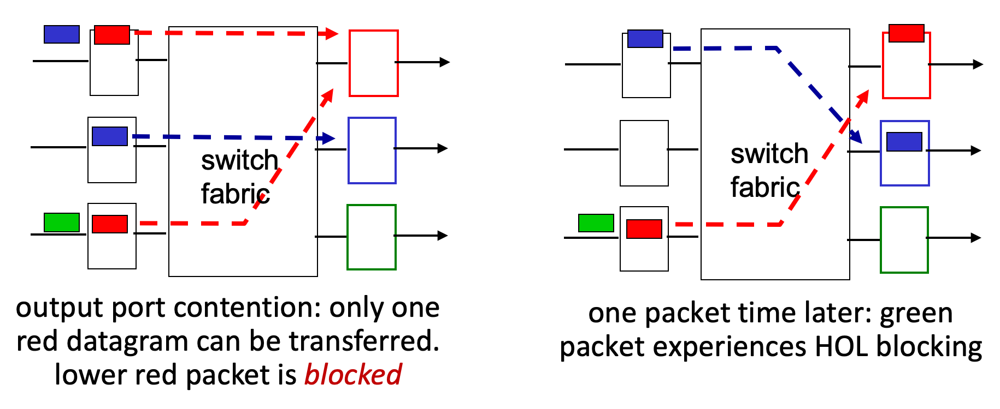

### Output port queuing

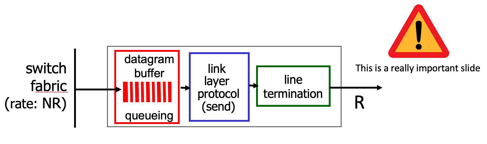

Two major issues:

* `Buffering` required when datagrams arrive from fabric faster than link transmission rate. `Drop policy:` which datagrams to drop if no free buffers? -> Datagrams can be lost due to congestion, lack of buffers

* `Scheduling discipline` choose among queued datagrams for transmission -> Priority scheduling - who gets best performance, network neutrality

---
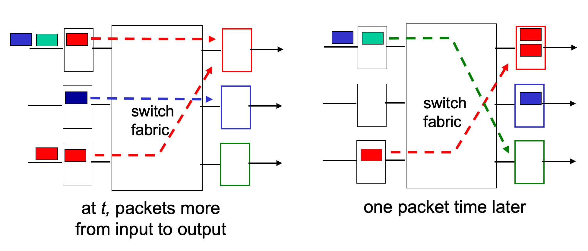

* buffering when arrival rate via switch exceeds output line speed
* queuing (delay) and loss due to output port buffer overflow!

### Buffer Management

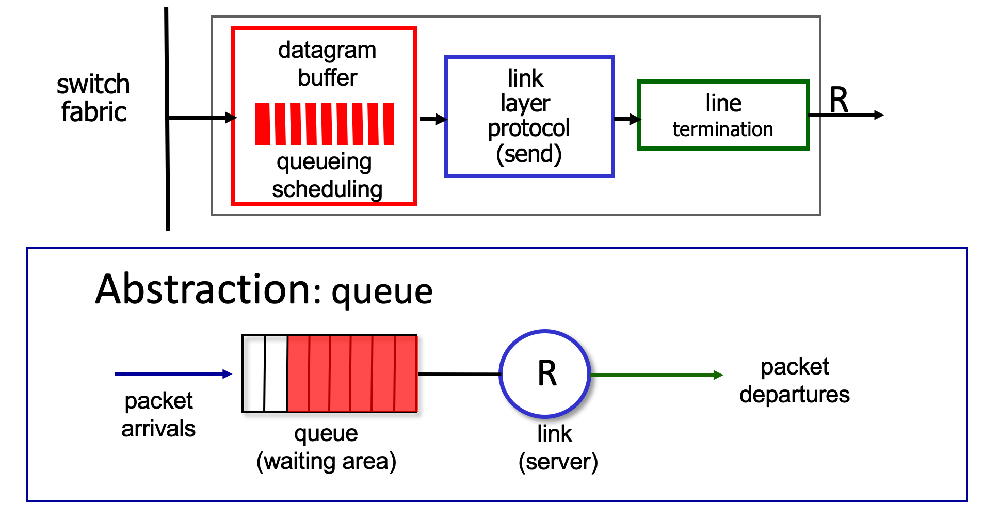

`buffer management:`
* `drop:` which packet to add, drop when buffers are full
    * `tail drop`: drop arriving packet
    * `priority`: drop/remove on priority basis
* `marking:` which packets to mark to signal congestion (ECN, RED(Random Early Detection))

### Packet Scheduling
`packet scheduling:` deciding which packet to send next on link
* first come, first served
* priority
* round robin
* weighted fair queueing

### Scheduling policies: FCFS
`FCFS:` packets transmitted in order of arrival to output port
* a.k.a., First-In-First-Out (FIFO)

### Scheduling policies: priority
`Priority scheduling:`
* arriving traffic classified, queued by class
    * any header fields can be used for classification
    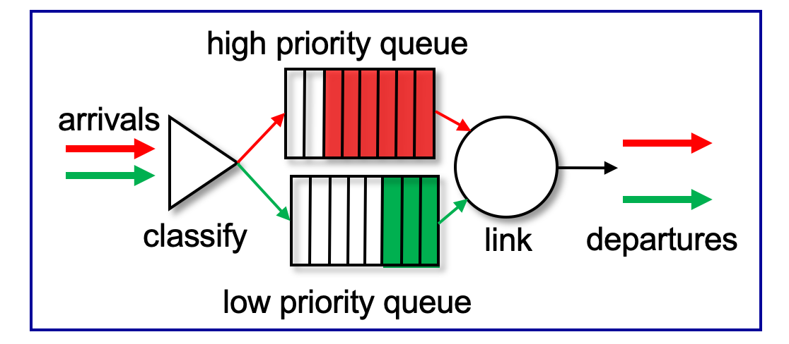

* send packet from highest priority queue that has buffered packets
    * FCFS within priority class

### Scheduling policies: RR
`Round Robin(RR) scheduling:`
* arriving traffic classified, queued by class
    * any header fields can be used for classification
    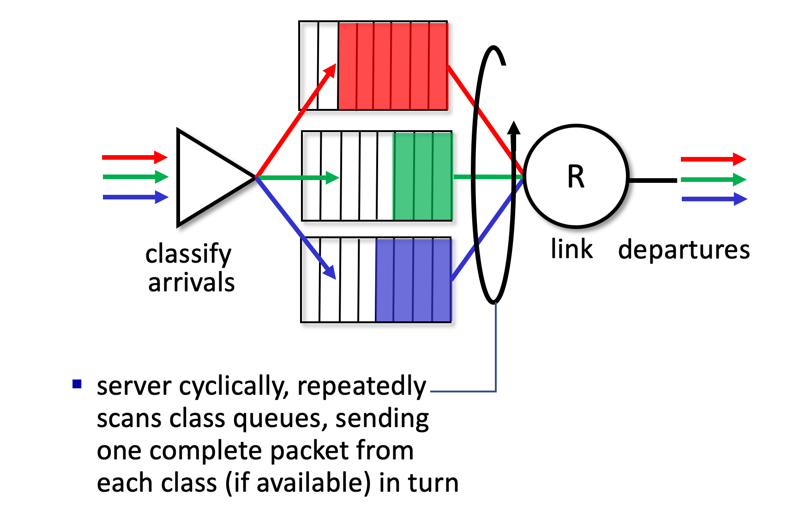

### Scheduling policies: weighted fair queuing
`Weighted Fair Queuing (WFQ):` generalized Round Robin

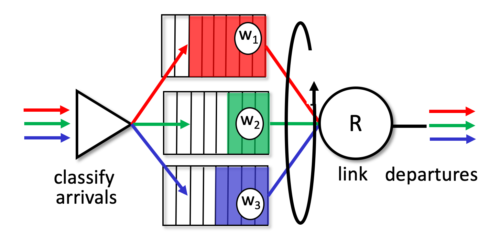

* each class i, has weight, ${w_i}$, and gets weighted amount of service in each cycle: ${w_i\over{\sum _jw_j}}$
* minimum bandwidth guarantee (per-traffic-class)