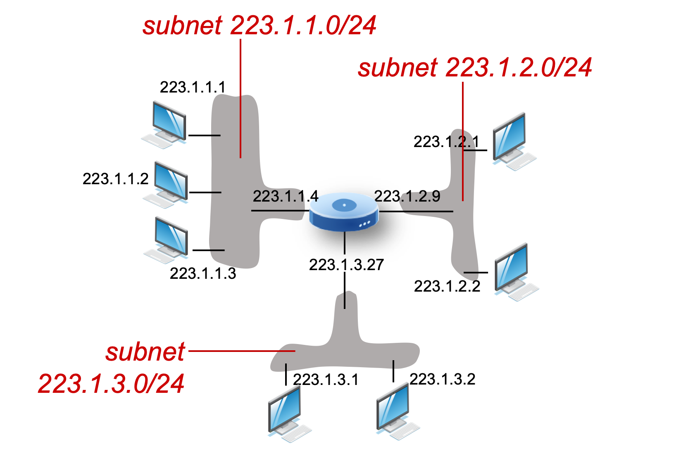

# 4.IV. IP Address and Subnet

## IP addressing: introduction

* IP address: 32-bit identifier associated with each host or router `interface`
    * interface: connection between host/router and physical link
        * router's typically have multiple interfaces
        * host typically has one or two interfaces (e.g., wired Ethernet, wireless 802.11)

## Subnet

* device interfaces that can physically reach each other `without passing through an intervening router`

* IP address have structure:
    * subnet part: devices in same subnet have common high order bits
    * host part: remaining low order bits
    * route of transferring a data to another: local host IP -> router input IP (local subnet) -> router output IP (dest subnet) -> destination host IP

### Recipe for defining subnets:

* detach each interface from its host or router, creating 'islands' of isolated networks
* each isolated network is called a `subnet`

* subnet mask: /24
    * high-order 24 bits: subnet part of IP address
    * the last 8 bits reserved value:
        * 0 for referring to subnet
        * 255 for sending to all the hosts under this subnet