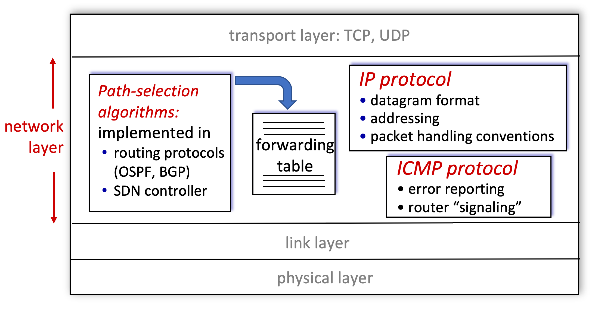
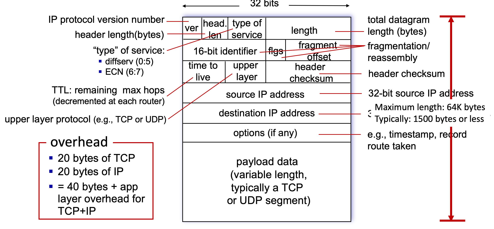

# 4.III. IP Header Format

## Network Layer: Internet
* host, router network layer functions:

## IP Datagram format

### IPv4

* ver of IPv4 should be specified with `4`;
* generally, the option entry is seldom to be utilized. Therefore the size of IP header should be `20 bytes`, and head len should be `5`;
* so for most IPv4 header, should start with `45` in header;
* mostly, the value of type of service would be zeros which indicating no specifying service type.
* length: in general, length of packet would be around 1000 bytes.
* time to live: usually upper than 64
* upper layer protocol: a value indicating protocol of transport layer
    * TCP: 6
    * UDP: 17