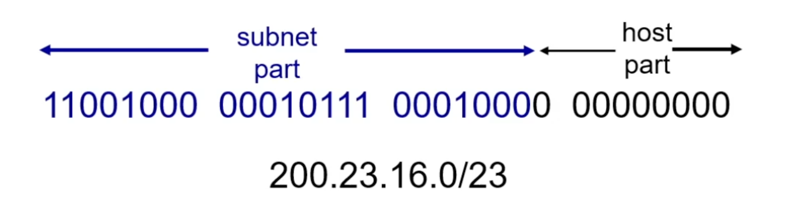
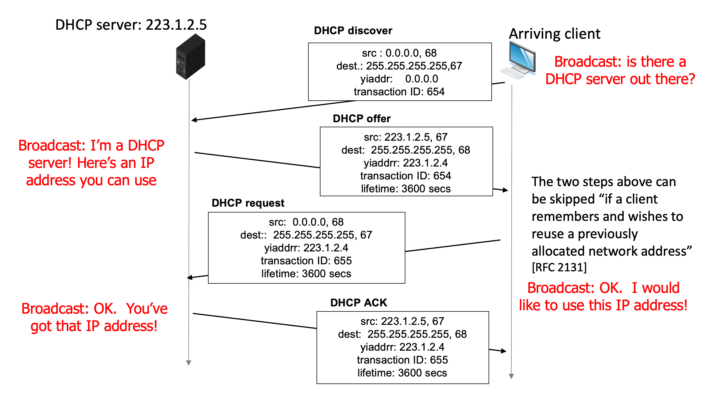
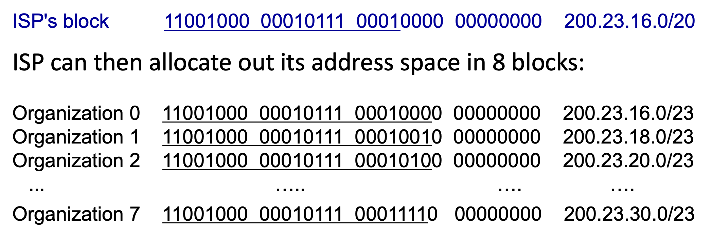

# 4.V. CIDR & DHCP

## `CIDR`: Classes InterDomain Routing (pronounced "cider")
* subnet portion of address of arbitrary length
* address format: `a.b.c.d/x`, where x is # bits in subnet portion of address

## IP address: How to get one?

There are two major issues referred to getting one IP address:
* How does a host get IP address within its network (host part of address)?
* How does a network get IP address for itself (network part of address)?

### `How does host get IP address?`
* hard-coded by sysadmin in config file (e.g., /etc/rc.config in UNIX)
* `DHCP`: `D`ynamic `H`ost `C`onfiguration `P`rotocol: dynamically get address from server
    * "plug-and-play"

### DHCP: Dynamic Host Configuration Protocol
`goal`: host dynamically obtains IP address from network server when it "joins" network
* can renew its lease on address in use
* allow reuse of addresses (only hold address while connected/on)
* support for mobile users who join/leave network
* `DHCP overview`:
    * `host` broadcasts `DHCP discover` msg [optional]
    * `DHCP server` responds with `DHCP offer` msg [optional]
    * `host` requests IP address: `DHCP request` msg
    * `DHCP server` sends address: `DHCP ack` msg

    

    * **DHCP discover**
        * src: source IP is 0.0.0.0 as it has not obtained the IP address
        * port 68: port number of DHCP hosts
        * 255.255.255.255 means broadcasting
        * port 67: port number of DHCP server
        * tranaction ID: ...like ID of chatting room

    * **DHCP offer**
        * src: source IP of DHCP server
        * yiaddrr: the IP address available to the host
        * lifetime: the valid time for the IP address

    * **DHCP request**
        * src: still using 0.0.0.0 with port# equal to 68
        * dest: still broadcasting...why?
        * yiaddrr: the requested/available IP address provided before
        * transaction ID: start a new transaction with a different ID to previous

### DHCP: more than IP addresses

* DHCP can return more than just allocated IP address on subnet:
    * address of first-hop router for client
    * name and IP address of DNS server
    * network mask (indicating network versus host portion of address)

### `How does network get subnet part of IP address?`

A: gets allocated portion of its ISP's address space

### `How does ISP get block of addresses?`

A: `ICANN`: Internet Corporation for Assigned Names and Numbers

* http://www.icann.org
* allocates IP addresses, through `5 regional registries (RRs)`(who may then allocate to local registries)
* manages DNS root zone, including delegation of individual TLD (.com, .edu, ...) management

### `Are there enough 32-bit IP address?`
* ICANN allocated last chunk of IPv4 addresses to RRs in 2011
* NAT(next) helps IPv4 address space exhaustion
* IPv6 has 128-bit address space