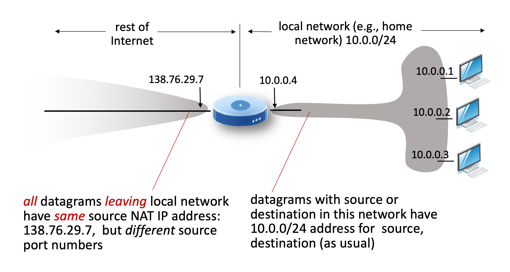

# 4.VI. NAT-Network Address Translation

## `NAT`: all device in local network share just one IPv4 address as far as outside world is concerned

* The address in local network is called as `private IP address`
* The address in global network is called as `public IP address`
* All devices in local network have 32-bit addresses in a "private" IP address space (10/8, 172.16/12, 192.168/16 prefixes) that can only be used in local network

## `implementation:` NAT router must

* for outgoing datagrams: replace (source IP address, port #) of every outgoing datagram with (NAT IP address, new port #)
    * remote clients/servers will respond using NAT IP addr and new port # as destination address

* for incoming datagrams: replace back the IP address and port # corresponded to new port #

## NAP has been controversial:

* routers "should" only process up to layer 3, but port # is in layer 4
* address "shortage" should be solved by IPv6
* violates end-to-end argument (port# manipulation by network-layer device)
* NAT traversal: what if client wants to connect to server behind NAT?