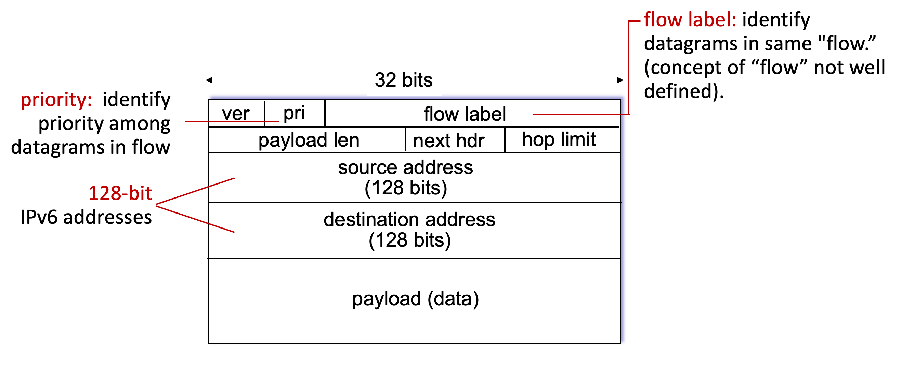

# 4.VII. IPv6

## Motivation

* `initial motivation`: solve the address supply shortage problem

* additional motivation:
    * speed processing/forwarding: 40-byte fixed length header
    * enable different network-layer treatment of "flows"

## Datagram format

* next hdr represent the info in upper layer
    * 6 for TCP
    * 17 for UDP
* hop limit = TTL

### What's missing (compared to IPv4)?

* no checksum (to speed processing at routers)
* no fragmentation/reassembly
* no options (available as upper-layer, next-header protocol at router)

### Transition from IPv4 to IPv6

* not all routers can be upgraded simultaneously

* `tunneling`: IPv6 datagram carried as payload in IPv4 datagram among IPv4 routers ("packet within a packet")
    * by middle routers who support both IPv4 and IPv6