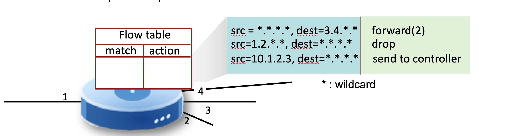
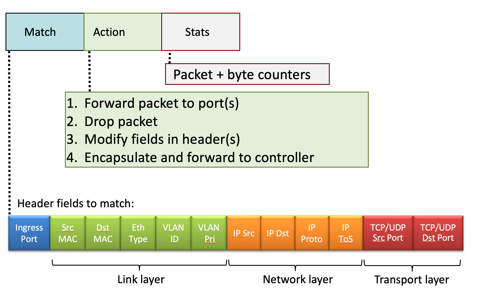
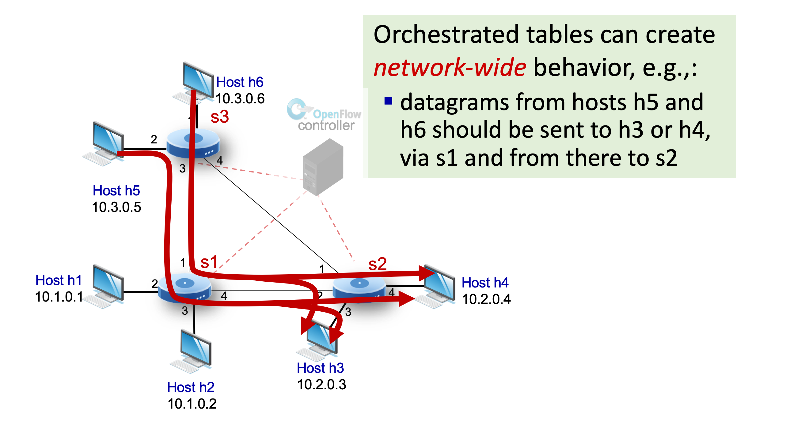

# 4.VIII Generalized Forwarding

## Generalized forwarding: match plus action

* Each router contains a forwarding table
    * `"match plus action"` abstraction: match bits in arriving packet, take action.
        * `destination-based forwarding`: forward based on dest. IP addr.
        * `generalized forwarding`:
            * many header fields can determine action;
            * many action possible: drop/copy/modify/log packet

* `generalized forwarding`: simple packet-handling rules
    * `match`: pattern values in packet header fields
    * `actions`: for matched packet: drop/forward/modify matched packet or send matched packet to controller
    * `priority`: disambiguate overlapping patterns (packet might match multiple actions, the priority provides criterion to decide which action should be took.)
    * `counters`: # of bytes and # of packets

* `flow`: defined by header field values (in link-, network-, transport-layer field)

* forwarding table = flow table
    * defines pairwise match, action rules

* example
    * `Forwarding`: "IP Dst = 51.6.0.8" takes action "forward to router output port 6"
    * `Firewall`: "TCP d-port = 22" takes action "drop"
        * "TCP d-port = 22" usually used as SSH port #
        * utilize this rule to block all the connection request via SSH
    * `Firewall`: "IP Src = 128.119.1.1" takes action "drop"
        * block particular remote host/hosts by IP addr. .
    * `Layer 2 destination-based forwarding`: "MAC dst = 22:A7:23:11:E1:02" takes action "forward to output port 3"

* `Question: Can we block packet from particular router?`

## OpenFlow abstraction

* `match + action`: abstraction unifies different kinds of devices
    * `Router`
        * match: longest destination IP prefix
        * action: forward out a link
    * `Switch`
        * match: destination MAC address
        * action: forward or flood
    * `Firewall`
        * match: IP address and TCP/UDP port numbers
        * action: permit or deny
    * `NAT`
        * match: IP addr. and port
        * action: rewrite addr. and port

