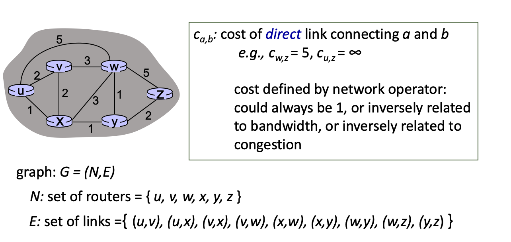
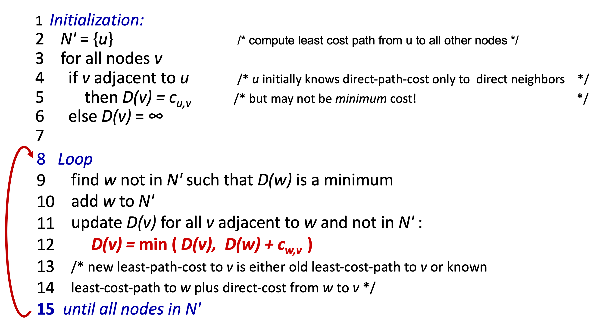
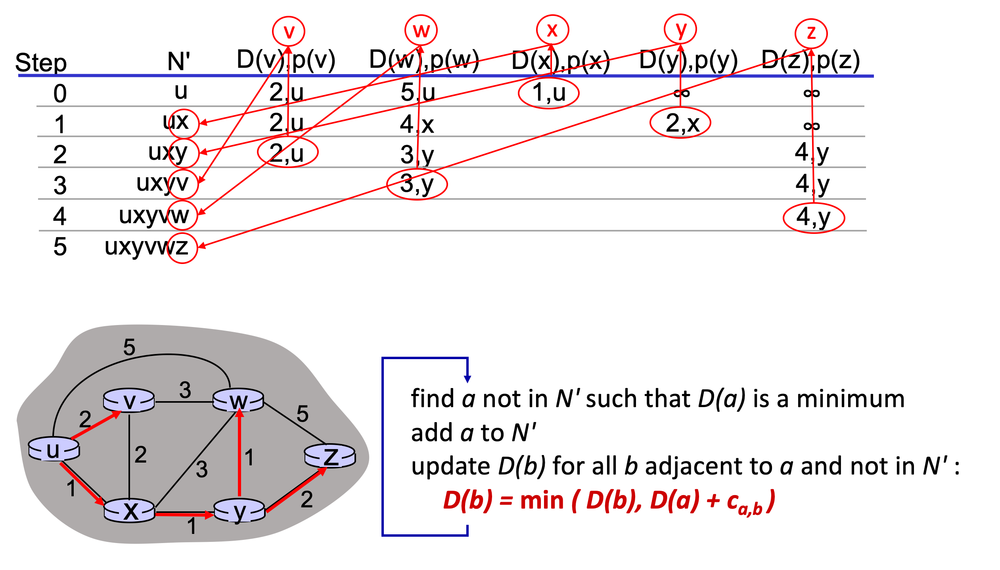
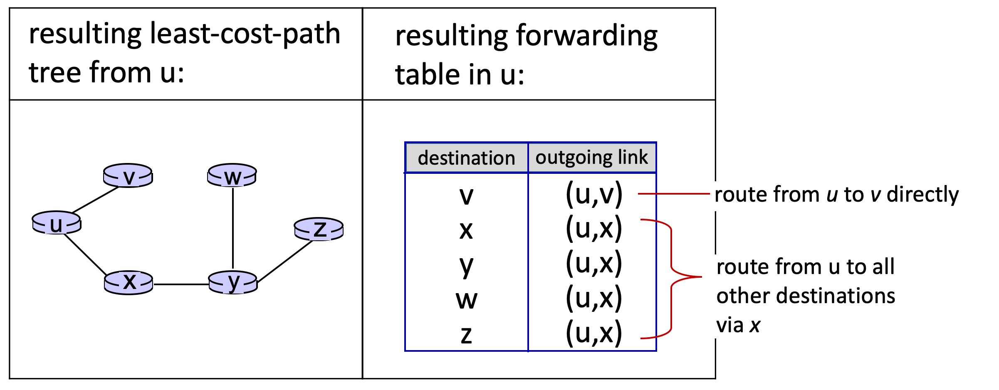

# 5.I.A Routing Protocol Functions

## Network-layer functions

* forwarding: move packets from router's input to appropriate router output -> Data plane

* routing: determine route taken by packets from source to destination -> `Control plane`

* Two approaches to structuring network control plane
    * per-router control (traditional)
    * logically centralized control (software defined networking)

## Routing protocols

* `Goal`: determine "good" paths (equivalently, routes), from sending hosts to receiving host, through network of routers
    * `path:` sequence of routers packets traverse from given initial source host to final destination host
    * `good:` least "cost", "fastest", "least congested"
    * routing: a top 10 network challenge!

## Graph abstraction: link costs

## Routing algorithm classification

* Info Perspective
    * `link state algorithm:` all routers have complete topology, link cost info (global)
    * `distance vector algorithms:` iterative process of computation, exchange of info with neighbors (decentralized)
        * routers initially only know link costs to attached neighbors

* Changing Speed Perspective
    * `Static:` routes change slowly over time. Usually changed manually.
    * `Dynamic`: routes change frequently and quickly
        * periodic updates or in response to link cost changes

# 5.I.B Dijkstra's Algorithm (Pronounced Destra)

* `centralized:` network topology, link costs known to all nodes
    * accomplished via "link state broadcast"
    * all nodes have same info

* computes least cost paths from one node ("source") to all other nodes
    * gives forwarding table for that node

* iterative: after K iterations, know least cost path to k destinations

* `notation`:
    * ${C_{x,y}}$: direct link cost from node x to y; default to ${\infty}$ if not direct neighbors;
    * ${D(v)}$: current estimate of cost of least-cost-path from source to destination ${v}$
    * ${p(v)}$: predecessor node along path from source to ${v}$. (Consider as route to destination ${v}$)
    * ${N^\prime}$: set of nodes whose least-cost-path definitively known

* `procedure`
    

* example

    
    

## Dijkstra's algorithm discussion

* algorithm complexity: ${n}$ nodes
    * each of n iteration: need to check all nodes
    * n(n+1)/2 comparisons: ${O(n^2)}$  complexity
    * more efficient implementations possible: ${O(n\log n)}$

* message complexity
    * each router must `broadcast` its link state information to other ${n}$ routers
    * efficient (and interesting!) broadcast algorithms: ${O(n)}$ link crossing to disseminate a broadcast message from one source
    * each router's message crosses ${O(n)}$ links: overall message complexity: ${O(n^2)}$