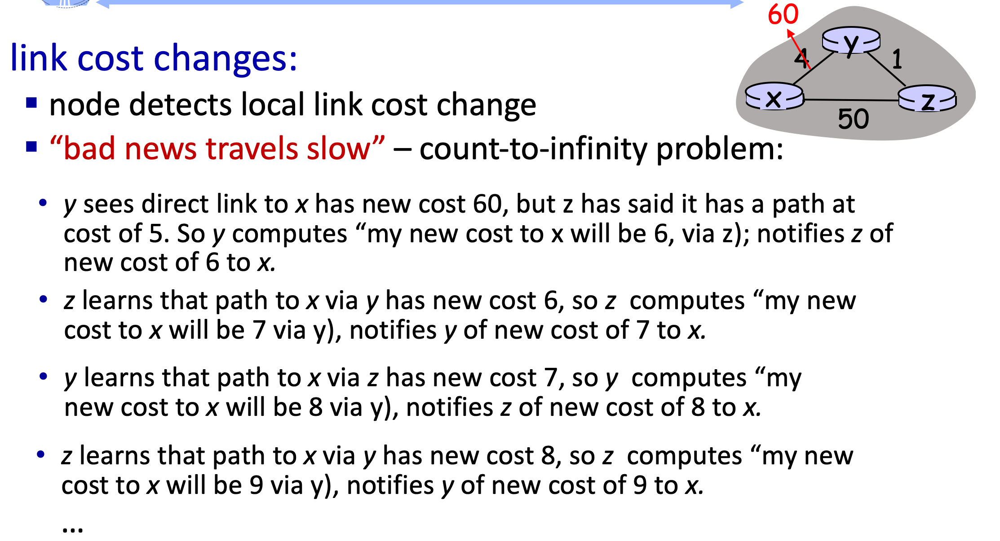

# 5.II. Distance Vector Algorithm

## Distance vector algorithm

* Based on `Bellman-Ford` (BF) equation (dynamic programming)

* Bellman-Ford equation
    * Let ${D_x(y)}$ denotes cost of least-cost path from x to y.
    * ${v}$ denotes neighbor node
    * ${C_{x,v}}$ denotes cost of path from ${x}$ to ${v}$
    * Then
        * ${D_x(y) = min_v\{C_{x,v} + D_v(y)\}}$

    * During iteration, we replace ${D_v(y)}$ with estimated value ${\hat{D}_v(y)}$

* Example
    

* Key idea:
    * from time-to-time, each node sends its own distance vector estimate to neighbors
    * when one node receive new DV estimate from any neighbor, it updates its own DV using B-F equation:
        * ${D_x(y) = min_v\{C_{x,v} + D_v(y)\}}$ for each node ${y \in N}$ where ${N}$ denotes set of ${x}$'s neighbors
        
    * each local iteration caused by
        * local link cost change
        * DV update message from neighbor

    * only notify neighbors if self DV has been changed

## Link cost changes

* `Good news travels fast`

* link cost changes:
    * node detects local link cost change
    * updates routing info, recalculates local DV
    * if DV changes, notify neighbors

* `Bad news travels slow`
    * The old/used info from neighbor nodes will give old cost info which affect the DV calculation.
    * example
        