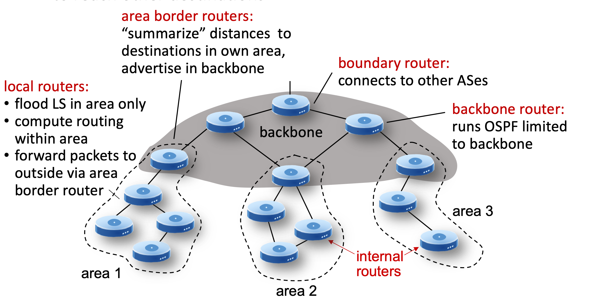

# 5.III. intra-AS routing: OSPF

## Making routing scalable

* `scale:` billions of destinations
    * can't store all destinations in routing tables
    * routing table exchange would swamp links
    * therefore we split the management of internet into hierarchical structure with corresponding administrative autonomy:
        * Internet: a network of networks
        * each network admin may want to control routing in its own network

* Internet approach to scalable routing
    * aggregate routers into regions known as "`autonomous system`" (AS) (a.k.a. "`domain`")

* `intra-AS` (a.k.a. "`intra-domain`"): routing among within same AS ("network")
    * all routers in AS must run same intra-domain protocol
    * routers in different AS can run different intra-domain protocols
    * gateway router: at "edge" of its own AS, has link(s) to router(s) in other AS'es

* `inter-AS` (a.k.a. "`inter-domain`"): routing among AS'es
    * gateways perform inter-domain routing (as well as intra-domain routing)

## Routing within an AS

* most common intra-AS routing protocols:

    * RIP: Routing Information Protocol [RFC 1723]
        * classic DV: DVs exchanged every 30 secs
        * no longer widely used

    * EIGRP: Enhanced Interior Gateway Routing Protocol
        * DV based
        * formerly Cisco-proprietary for decades (became open in 2013 [RFC 7868])

    * OSPF: Open Shortest Path First [RFC 2328]
        * link-state routing
        * IS-IS protocol (ISO standard, not RFC standard) essentially same as OSPF

* OSPF routing
    * "open": publicly available
    * classic link-state
        * each router floods OSPF link-state advertisements to all other routers in entire AS (directly over IP rather than using TCP/UDP)
        * multiple link costs metrics possible: bandwidth, delay
        * each router has full topology, uses Dijkstra's algorithm to compute forwarding table
    * security: all OSPF messages authenticated (to prevent malicious intrusion)
    * two-level hierarchy: local area, backbone.
        * link-state advertisements flooded only in area, or backbone
        * each node has detailed area topology; only knows direction to reach other destinations
        