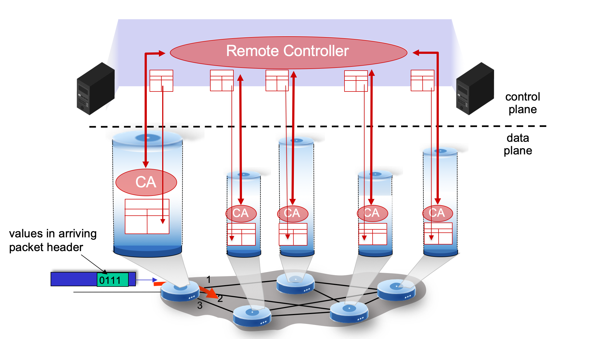

# 5.V. SDN control plane

## Software defined networking (SDN)

* Internet networking layer: historically implemented via distributed, per-router control approach:
    * `monolithic` router contains switching hardware, runs proprietary implementation of Internet standard protocols(IP, RIP, IS-IS, OSPF, BGP) in proprietary router OS (e.g., Cisco IOS)
    * not flexible. different "middleboxes" for different network layer functions: firewalls, load balancers, NAT boxes,.. function is determined by provider

## SDN control plane

* Remote controller computes, installs forwarding tables in routers
    

## Why a logically centralized control plane?

* easier network management: avoid router misconfigurations, greater flexibility of traffic flows
* table-based forwarding (recall OpenFlow API) allows "programming" routers
    * centralized "programming" easier: compute tables centrally and distribute
    * distributed "programming" more difficult: compute table as result of distributed algorithm (protocol) implemented in each-and-every router
* open(non-proprietary) implementation of control plane
    * foster innovation: let 1000 flowers bloom

## Data-plane switches

* fast, simple, commodity switches implementing generalized data-plane forwarding in hardware. ([Section4.8](../ch4-NetworkLayer_DataPlane/ch4_08_Generalized_Forwarding.md))

* flow(forwarding) table computed, installed under controller supervision

* API for table-based switch control (e.g., OpenFlow)
    * defines what is controllable, what is not

* protocol for communicating with controller (e.g., OpenFlow)

## SDN controller (network OS)

* maintain network state information

* interacts with network control applications "above" via northbound API

* interacts with network switches "below" via southbound API

* implemented as distributed system for performance, scalability, fault-tolerance, robustness

## Component of SDN controller

## SDN: selected challenges

* hardening the control plane: dependable, reliable, performance-scalable, secure distributed system
    * robustness to failures: leverage strong theory of reliable distributed system for control plane
    * dependability, security: "baked in" from day one?

* networks, protocols meeting mission-specific requirements
    * e.g., real-time, ultra-reliable, ultra-secure

* Internet-scaling: beyond a single AS

* SDN critical in 5G cellular networks