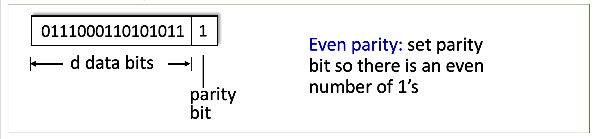
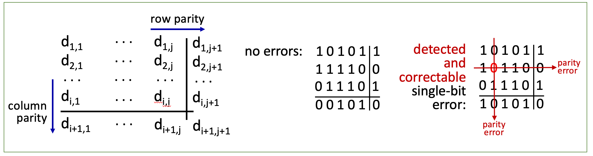
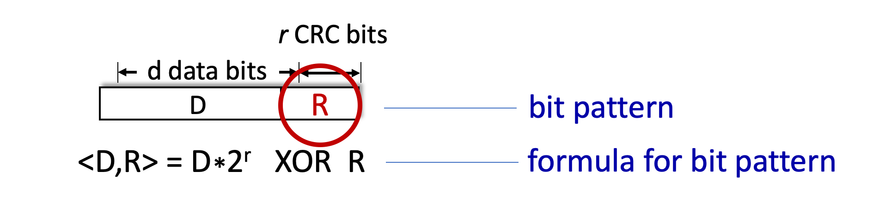

# 6.II Error detection, correction

## Error detection

* EDC: error detection and correction bits (e.g., redundancy)
* D: data protected by error checking, may include header fields

    

## Parity checking

`single bit parity`:
* detect single bit errors
    

    * could be set to odd optionally

`two-dimensional bit parity`:
* detect and correct single bit errors
    

## Cyclic Redundancy Check (CRC)

* more powerful error-detection coding
* D: data bits (given, think of these as a binary number)
* G: bit pattern (generator), of r+1 bits (given)
    

* goal:
    * choose r CRC bits, R, such that < D, R> exactly divisible by G (mod 2)
    * receiver knows G, divides < D, R> by G. If non-zero remainder: error detected!
    * can detect all burst errors less than r+1 bits
    * widely used in practice (Ethernet, 802.11 WiFi)
    * mostly r = 32, and known as `CRC32`
    
