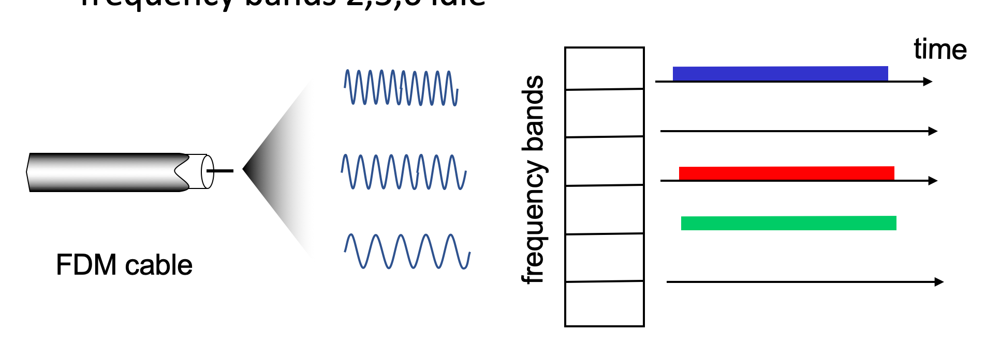

# 6.III. MAC protocols

## Two types of "links"

* point-to-point
    * Ethernet
    * PPP for dial-up access
* broadcast (shared wire or medium)
    * old-fashioned Ethernet
    * upstream HFC in cable-based access network
    * 802.11 wireless LAN, 4G/4G satellite

## Multiple access protocols

* single shared broadcast channel
* two or more simultaneous transmission by nodes: interference（干擾）
    * `collision` if node receives two or more signals at the same time

* `multiple access protocol`
    * distributed algorithm that determines how nodes share channel, i.e., determine when node can transmit
    * communication about channel sharing must use channel itself!
        * no out-of-band channel for coordination

## MAC protocols: taxonomy(分類)

* three broad classes
    * `channel partitioning`
        * divide channel into smaller "pieces" (time slots, frequency, code)
        * allocate piece to node for exclusive use
    * `random access`
        * channel not divided, allow collisions
        * "recover" from collisions
    * `taking turns`
        * nodes take turns, but nodes with more to send can take longer turns

---
## Channel partitioning MAC protocols

`TDMA: time division multiple access`
* access to channel in "rounds"
* each station gets fixed length (transmission time) slot (投入口) in each round 
* unused slots go idle (閒置）
* example:
    * 6-station LAN, 1,3,4 have packets to send, slots 2,5,6 idle
    

`FDMA: frequency division multiple access`
* channel spectrum divided into frequency bands
* each station assigned fixed frequency band
* unused transmission time in frequency bands go idle
* example:
    * 6-station LAN, 1,3,4 have packets to send, frequency bands 2,5,6 idle
    
---
## Random access protocols

* when node has packet to send
    * transmit at full channel data rate R
    * no a priori coordination among nodes

* two or more transmitting nodes: "collision"

* `random access MAC protocol` specifies
    * how to detect collisions
    * how to recover from collisions (e.g., via delayed retransmission)

* examples of random access MAC protocols:
    * ALOHA, slotted ALOHA
    * CSMA, CSMA/CD, CSMA/CA

`Slotted ALOHA`

* assumptions
    * all frames same size
    * time divided into equal size slots (time to transmit 1 frame)
    * nodes start to transmit only slot beginning
    * nodes are `synchronized`
    * if 2 or more nodes transmit in slot, all nodes detect collision

* operations
    * when node obtains fresh frame, transmits in next slot
        * if no collision: node can send new frame in next slot
        * if collision: node retransmits frame in each subsequent slot with probability ${p}$ until success
        

* efficiency
    

    * max efficiency = 1/e = 0.37
    * channel used for useful transmissions 37% of time

`Pure ALOHA (unslotted)`

* unslotted Aloha: simpler, no synchronization
    * when frame first arrives: transmit immediately
* collision probability increases with no synchronization
* max efficiency = 0.18

`CSMA (carrier sense multiple access)`

* simple `CSMA`: listen before transmit:
    * if channel sensed `idle`: transmit entire frame
    * if channel sensed `busy`: defer transmission
    * human analogy(比喻): don't interrupt others!

`CSMA/CD`
* CSMA with `collision detection`
    * collisions detected within short time
    * colliding transmissions aborted, reducing channel wastage
    * collision detection easy in wired, difficult with wireless
    * human analogy: the polite conversationalist

### collisions
* collisions can still occur with carrier sensing:
    * propagation delay means two nodes may not hear each other's just-started transmission
* CSMA/CD reduces the amount of time wasted in collisions
    * transmission aborted on collision detection

## "Taking turns" MAC protocols

`polling`
* master node "invites" other nodes to transmit in turn
* typically used with "dumb" devices
* concerns:
    * polling overhead
    * latency
    * single point of failure (master)
    

`token passing`
* control `token` passed from one node to next sequentially;
* only host hold `token` can transmit;
* if nothing to send, pass the `token` to next host;
* token message
* concerns:
    * token overhead
    * latency
    * single point of failure(token)
    

## Multiple MAC protocols under one scenario

* multiple downstream (broadcast) FDM channels: up to 1.6 Gbps/channel
    * single CMTS transmits into channels
* multiple upstream channels (up to 1 Gbps/channel)
    * multiple access: all users contend(爭取) (random access) for certain upstream channel time slots; other assigned TDM

`DOCSIS:` data over cable service interface specification

* FDM over upstream, downstream frequency channels
* TDM upstream: some slots assigned, some have contention
    * downstream MAP frame: assigns upstream slots
    * request for upstream slots (and data) transmitted random access (binary backoff) in selected slots

## Conclusion
* channel partitioning MAC protocols:
    * share channel efficiently and fairly at high load
    * inefficient at low load: delay in channel access, 1/N bandwidth allocated even if only 1 active node!

* random access MAC protocols
    * efficient at low load
    * collision overhead at high load
