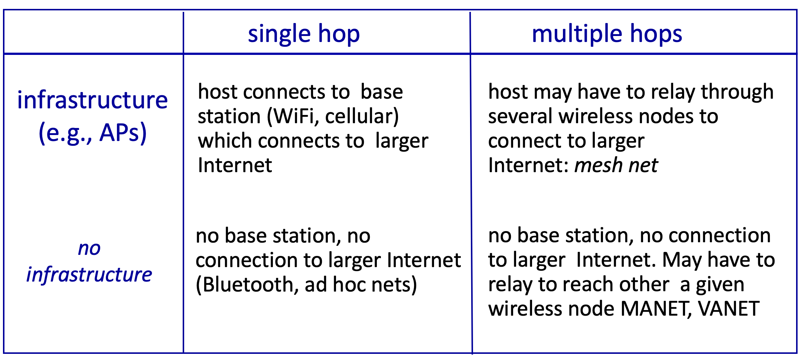

# 7.I. Wireless and Mobile Networks: context

* Two important (but different) challenges
    * `wireless`: communication over wireless link
    * `mobility`: handling the mobile user who changes point of attachment to network

## Element of a wireless network

* Wireless hosts
    * laptop, smartphone, IoT
    * run applications
    * may be stationary (non-mobile) or mobile
        * wireless does not always mean mobility

* base station
    * typically connected to wired network
    * relay - responsible for sending packets between wired network and wireless host(s) in its 'area'
        * e.g., cell towers, 802.11 access points

* wireless link
    * typically used to connect mobile(s) to base station, also used as backbone link
    * multiple access protocol coordinates link access
    * various transmission rates and distances, frequency bands

    

* infrastructure mode
    * base station connects mobiles into wired network
    * handoff: mobile changes base station providing connection into wired network

    

* ad hoc mode
    * no base stations
    * nodes can only transmit to other nodes within link converge
    * nodes organize themselves into a network: route among themselves
    

## Wireless network taxonomy

